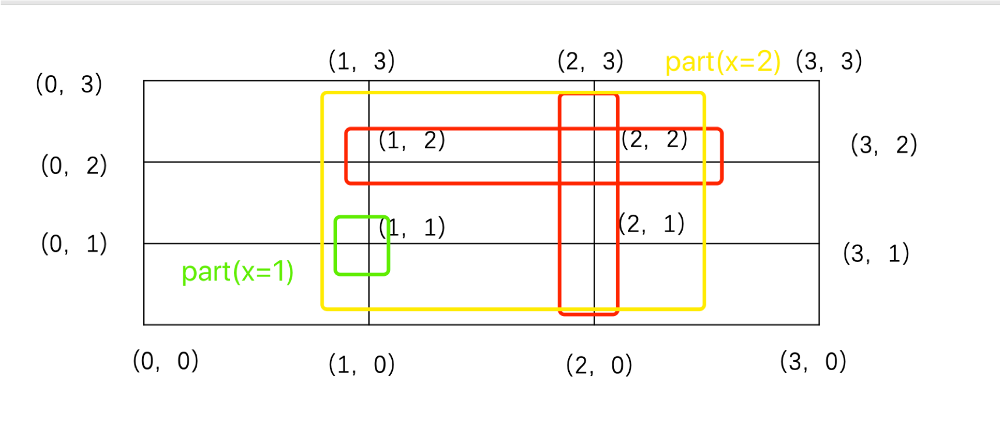

# LeetCodeAndOtherOJ

## string字符串问题
leetcode 2224. Minimum Number of Operations to Convert Time

题目描述：给定两个24小时的时间current和correct，格式为HH:MM，其中HH取值范围是00-23，MM取值范围是00-59，每次操作可以把current增加1分钟，5分钟，15分钟，60分钟。求最少多少次可以把current转换为correct。保证correct >= current。

思路：把current和correct转化为分钟，求出diff，用diff除以60，15，5，1，每次除完取模，求出分别用多少次，加和即可。

```cpp
class Solution {
public:
    int stringToInt(string &str) {
        int hour = stoi(str.substr(0,2));
        int min = stoi(str.substr(3,2));
        return hour*60+min;
    }
    int convertTime(string current, string correct) {
        int cur = stringToInt(current);
        int cor = stringToInt(correct);
        int diff = cor - cur;
        int res = 0;
        cout << diff << endl;
        if(diff >= 60) {
            res += diff / 60;
            diff = diff % 60;
        } 
        if (diff >= 15) {
            res += diff / 15;
            diff = diff % 15;
        }
        if (diff >= 5) {
            res += diff / 5;
            diff = diff % 5;
        }
        res += diff;
        return res;
    }
};
```

## 二进制字符串问题

```cpp
class Solution {
public:
    int missingNumber(vector<int>& nums) {
        int s = accumulate(nums.begin(), nums.end(), 0);
        int n=nums.size();
        int t = (n+0)*(n+1)/2;
        return t-s;
    }
};
```

leetcode 1016 Binary String With Substrings Representing 1 To N

题目描述：给定一个字符串，和N。求1-N内的数字转化成二进制能否在字符串中找到。

思路：使用bitset，将数字转换为二进制字符串，进而使用find寻找

```cpp
class Solution {
public:
    bool queryString(string S, int N) {
        while(N) {
            bitset<32> b(N--);
            string x = b.to_string();
            if(S.find(x.substr(x.find('1'))) == string::npos) return false;
        }
        return true;
    }
};
```

## 最长递增子序串/序列
### 最长递增字串
leetcode 674 Longest Continuous Increasing Subsequence

题目描述：给定一个数组，求最长递增子序列的长度。

思路：扫一遍数组，不断更新最长的长度。

```cpp
class Solution {
public:
    int findLengthOfLCIS(vector<int>& nums) {
        if(nums.size() == 0) return 0;
        int res = 0, tmp = 1;
        for(int i=1;i<nums.size();++i) {
            if(nums[i] > nums[i-1]) tmp++;
            else {
                res = max(res, tmp);
                tmp = 1;
            }
        }
        res = max(res, tmp);
        return res;
    }
};
```

leetcode 673 Number of Longest Increasing Subsequence

题目描述：给定一个数组，求出其最长递增子序列的个数。

思路：本题使用dp，定义len数组代表以每个位置结尾的最长递增子序列的长度。定义cnt数组代表以每个位置结尾的最长递增子序列的个数。对于每个数字遍历其之前的所有数字，如果nums[i] <= nums[j]，那么无法构成递增子序列，不进行更新。如果nums[i] > nums[j]，那么判断len[i]是否等于len[j]+1，这代表将nums[i]接到nums[j]后面构成新的递增子序列，同时更新cnt[i]+=cnt[j]。如果len[i] < len[j] + 1，这代表出现了更长的递增子序列，那么需要将cnt[i] = cnt[j]，len[i] = len[j] + 1。每次更新完len[i]，检查最长的长度有没有变化，如果没有变化，那么res+=cnt[i]，反之res = cnt[i]。

```cpp
class Solution {
public:
    int findNumberOfLIS(vector<int>& nums) {
        int res = 0, mx = 0;
        vector<int> len(nums.size(), 1), cnt(nums.size(), 1);
        for(int i=0;i<nums.size();++i) {
            for(int j=0;j<i;++j) {
                if(nums[i] <= nums[j]) continue;
                if(len[i] == len[j] + 1) cnt[i] += cnt[j];
                else if(len[i] < len[j] + 1){
                    cnt[i] = cnt[j];
                    len[i] = len[j] + 1;
                }
            }
            if(mx == len[i]) res += cnt[i];
            else if(mx < len[i]){
                mx = len[i];
                res = cnt[i];
            }
        }
        return res;
    }
};
```

## 不重复数字，重复数字问题

leetcode 357 Count Numbers with Unique Digits

题目描述：给定一个n，求出[0,$10^n$)之间数字中没有重复数字的数量。

思路：开始想算出重复的，使用总共的减去重复的，但是太麻烦了。后来发现直接计算不重复的即可。
如果只有1位，那么有10个[0-9]，如果是2位，那么第一位可以从0-9中间选一个，第二位可以在其余的9个中选一个。后面的数字相同的逻辑。

```cpp
class Solution {
public:
    int countNumbersWithUniqueDigits(int n) {
        int res = 1;
        for(int i=1;i<=n;++i) {
            res += f(i);
        }
        return res;
    }
    
    int f(int i) {
        if(i == 1) return 9;
        int x = 9, total=9;
        for(int j=0;j<i-1;++j) {
            total = total * x;
            x--;
        }
        return total;
    }
};
```

## DFS

leetcode 401 Binary Watch

题目描述：给定一个二进制表，求出时间。

思路：主要学习一种简单的写法，使用了bitset

```cpp
class Solution {
public:
    vector<string> readBinaryWatch(int num) {
        vector<string> res;
        for (int h = 0; h < 12; ++h) {
            for (int m = 0; m < 60; ++m) {
                if (bitset<10>((h << 6) + m).count() == num) {
                    res.push_back(to_string(h) + (m < 10 ? ":0" : ":") + to_string(m));
                }
            }
        }
        return res;
    }
};
```

leetcode 526 Beautiful Arrangement

题目描述：假设有从 1 到 N 的 N 个整数，如果从这 N 个数字中成功构造出一个数组，使得数组的第 i 位 (1 <= i <= N) 满足如下两个条件中的一个，我们就称这个数组为一个优美的排列。条件：

第 i 位的数字能被 i 整除
i 能被第 i 位上的数字整除
现在给定一个整数 N，请问可以构造多少个优美的排列？


思路：递归生成排列，判断是不是符合条件。

```cpp
class Solution {
public:
    int countArrangement(int N) {
        vector<int> v(N+1);
        for(int i=1;i<=N;++i) {
            v[i] = i;
        }
        int res = 0;
        dfs(v, 1, res);
        return res;
    }
    
    void dfs(vector<int> &v, int pos, int &res) {
        if(pos == v.size()) {
            res++;
            return;
        }
        for(int i=pos; i<v.size(); ++i) {
            swap(v[pos], v[i]);
            if(v[pos] % pos == 0 || pos % v[pos] == 0)
                dfs(v, pos+1, res);
            swap(v[pos], v[i]);
        }
    }
};
```

leetcode 784 Letter Case Permutation

题目描述：给定一个字符串，可以把字母变成大写或者小写，求出所有字符串。

思路：dfs，遇到字符分叉搜索两种情况。

```cpp
class Solution {
public:
    vector<string> letterCasePermutation(string S) {
        vector<string> res;
        dfs(res, S, 0);
        return res;
    }
    
    void dfs(vector<string> &res, string & s, int pos) {
        if(pos == s.size()) {
            res.push_back(s);
            return;
        }
        if((s[pos] >= 'a' && s[pos] <= 'z') || (s[pos] >= 'A' && s[pos] <= 'Z')) {
            dfs(res, s, pos+1);
            s[pos] = s[pos] >= 'a' ? s[pos] - 'a' + 'A' : s[pos] - 'A' + 'a';
            dfs(res, s, pos+1);
        } else {
            dfs(res, s, pos+1);
        }
    }
};
```

leetcode 842 Split Array into Fibonacci Sequence

题目描述：给定一个数字组成的字符串，拆分字符串并判断能否构成斐波那切数列。

思路：进行dfs搜索，根据不同情况进行剪枝。注意stoi只能返回int类型。

```cpp
class Solution {
public:
    vector<int> splitIntoFibonacci(string S) {
        vector<int> res, tmp;
        dfs(S, 0, tmp, res);
        return res;
    }
    
    void dfs(string &s, int pos, vector<int> &tmp, vector<int> &res) {
        if(res.size() > 0) return;
        if(s.size() == pos) {
            if(tmp.size() >= 3)
                res = tmp;
            return;
        }
        for(int i=pos+1;i<=s.size();++i) {
            string snum = s.substr(pos, i-pos);
            if(snum[0] == '0' && snum.size() > 1) return;
            if(snum.size() >= 11 || (snum.size() == 10 && snum > "2147483647")) return;
            int num = stoi(snum);
            tmp.push_back(num);
            int val = isValid(tmp);
            if(val == 1) dfs(s, i, tmp, res);
            else if(val == 2) {
                tmp.pop_back();
                break;
            }
            tmp.pop_back();
        }
    }
    
    int isValid(vector<int> &res) {
        if(res.size() < 3) return 1;
        for(int i=2;i<res.size();++i) {
            long long int s1 = res[i-2];
            long long int s2 = res[i-1];
            long long int s = s1 + s2;
            if(s > INT_MAX) return 2;
            if(s < res[i]) return 2;
            else if(s > res[i]) return 3;
        }
        return 1;
    }
};


```

leetcode 980 Unique Paths III

题目描述：给定一个矩阵，1代表开始为止，2代表结束为止，-1代表障碍物，0代表路。求走过所有0的情况下，从1到2的路径的数量。

思路：dfs，每次走一步，直到0的数量变为0.

```cpp
class Solution {
public:
    int uniquePathsIII(vector<vector<int>>& grid) {
        int cnt = 1, res=0;
        int start_x, start_y, end_x, end_y;
        for(int i=0;i<grid.size();++i) {
            for(int j=0;j<grid[0].size();++j) {
                if(grid[i][j] == 0) cnt++;
                if(grid[i][j] == 1) {
                    start_x = i;
                    start_y = j;
                }
                if(grid[i][j] == 2) {
                    end_x = i;
                    end_y = j;
                }
            }
        }
        dfs(grid, start_x, start_y, end_x, end_y, cnt, res);
        return res;
    }
    
    void dfs(vector<vector<int>> &grid, int start_x, int start_y, int end_x, int end_y, int cnt, int& res) {
        if(start_x < 0 || start_x >= grid.size() || start_y < 0 || start_y >= grid[0].size() || grid[start_x][start_y] == -1) return;
        if(cnt == 0) {
            // cout << start_x << " " << start_y << " " << end_x << " " << end_y << endl;
            if(start_x == end_x && start_y == end_y) res++;
            return;
        }
        if(grid[start_x][start_y] == 2) return;
        cnt--;
        grid[start_x][start_y] = -1;
        dfs(grid, start_x+1, start_y, end_x, end_y, cnt, res);
        dfs(grid, start_x, start_y+1, end_x, end_y, cnt, res);
        dfs(grid, start_x-1, start_y, end_x, end_y, cnt, res);
        dfs(grid, start_x, start_y-1, end_x, end_y, cnt, res);
        cnt++;
        grid[start_x][start_y] = 0;
    }
};
```

leetcode 996 Number of Squareful Arrays

题目描述：给定一个数组，求出能够成为完美平方数组的排列数量。

思路：dfs，通过交换，不断生成排列，每次生成之后可以测试交换到当前位置为止，是否满足条件。

```cpp
class Solution {
public:
    int numSquarefulPerms(vector<int>& A) {
        set<vector<int>> s;
        dfs(A, 0, s);
        return s.size();
    }
    
    void dfs(vector<int> &A, int pos, set<vector<int>>& s) {
        if(pos == A.size()) {
            if(isValid(A, A.size()-1)) {
                s.insert(A);
            }
            return ;
        }
        for(int i=pos;i<A.size();++i) {
            if(i!=pos && A[i] == A[pos]) continue;
            swap(A[pos], A[i]);
            if(isValid(A, pos-1))
                dfs(A, pos+1, s);
            swap(A[pos], A[i]);
        }
    }
    
    bool isValid(vector<int>& A, int end) {
        for(int i=0;i<end;++i) {
            int num = sqrt(A[i] + A[i+1]);
            if(num * num != (A[i] + A[i+1])) return false;
        }
        return true;
    }
};
```

## 背包问题
*0-1背包问题*

leetcode 416 Partition Equal Subset Sum 

题目描述：
给定一个正整数的numlist，划分成加和相等的两部分。

思路：
可以转换为0/1背包问题，加和除以2就是背包的容量。这道题要求背包恰好装满。

```python
class Solution(object):
def canPartition(self, nums):
    """
    :type nums: List[int]
    :rtype: bool
    """
    s = sum(nums)
    V = s // 2
    if 2*V != s:
        return False
    MIN_INF = -20000 * 101
    l = [MIN_INF] * (V+1)
    l[0] = 0
    for i in range(1, len(nums)+1):
        for v in range(V, nums[i-1]-1, -1):
            l[v] = max(l[v], l[v-nums[i-1]]+1)
    if l[V] > 0 :
        return True
    else:
        return False
```

## 其他动态规划问题

leetcode 53 Maximum Subarray

题目描述：给定一个数组，寻找最大的自数组。

思路：e = max(a_i, e)，e代表之前子序列的最大值。

```python
class Solution(object):
def maxSubArray(self, nums):
    """
    :type nums: List[int]
    :rtype: int
    """
    e = nums[0]
    max_e = e
    for i in range(1, len(nums)):
        e = max(e+nums[i], nums[i])
        max_e = max(e, max_e)
    return max_e
```

[leetcode 2222. Number of Ways to Select Buildings](https://leetcode.com/problems/number-of-ways-to-select-buildings/)

题目描述：给定一个字符串，包含'0'和'1'两种字符。从中间挑出3个字符，挑出的三个字符顺序不变，要求连续的两个字符不能相同。一共有多少种符合要求的字符串。

思路一：使用一个数组v记录每个位置后面数字的情况，如果第i个位置是1，那么记录后面有多少个0。如果第i个位置是0，记录后面有多少个1。

用另一个数组res，记录每个位置有多少个解。从后往前走，i表示第一个数字的位置，j表示第二个数字的位置。如果s[i] != s[j]，那么此时可能是010或者101的一种，无所谓哪种解法是一样的。此时解的数量为v[j]。例如：s[i]为1，s[j]为0，v[j]表示第j个位置后面有多少个1，所以s[i]s[j]解的数量为v[j]。如果s[i] == s[j]，那么后续解的数量和res[j]一样，直接加上res[j]即可。最后把每个位置的解相加就是最后的答案。

```cpp
class Solution {
public:
    long long numberOfWays(string s) {
        vector<long long int> v(s.size(), 0);
        long long ones=0, zeros=0;
        for(int i=s.size()-1; i>=0; --i) {
            if(s[i] == '0') {
                zeros++;
                v[i] = ones;
            } else {
                ones++;
                v[i] = zeros;
            }
        }
        vector<long long int> res(s.size(), 0);
        for(int i=s.size()-3;i>=0;--i) {
            for(int j=i+1;j<s.size()-1;++j) {
                if(s[i] != s[j]) {
                    res[i] += v[j];
                    if(v[j] == 0) break;
                } else {
                    res[i] += res[j];
                    break;
                } 
            }
        }
        long long result = 0;
        for(auto x: res) result += x;
        return result;
    }
};
```

思路二：统计字符串中有多少个1记录在ones中，多少个0记录在zeros中。依次遍历字符串每个位置，使用bones记录该位置前面有多少个1，bzeros记录前面有多少个0。对于位置i，如果s[i]为1，那么前面的0和后面的0可以组成010，那么解的个数是bzeros*zeros，之后对bones++，ones--；如果s[i]为0，前面的1和后面的1可以组成101，那么解的个数为bones*ones，之后bzeros++，zeros--；


```cpp
class Solution {
public:
    long long numberOfWays(string s) {
        long long ones=0, zeros=0;
        for(int i=s.size()-1; i>=0; --i) {
            if(s[i] == '0') {
                zeros++;
            } else {
                ones++;
            }
        }
        long long bones=0, bzeros=0, res=0;
        for (int i=0;i<s.size();++i) {
            if(s[i] == '0') {
                res += bones*ones;
                bzeros++;
                zeros--;
            } else {
                res += bzeros*zeros;
                bones++;
                ones--;
            }
        }
        return res;
    }
};
```


## 公共字串和公共子序列问题

### 最长公共子序列
子序列可以不用是相连的字符串。源字符串使用S表示，目标串使用T表示。这里分两种情况讨论，当S[i] = T[j]时，最长子序列的长度为dp[i][j] = dp[i-1][j-1]+1，也就是说比之前的最长公共子序列的长度多了1。当S[i]!=T[j]时，dp[i][j]=max(dp[i-1][j], dp[i][j-1])，也就是说当两个字符不等的时候，考虑少一个字符和另一个串的关系。初始化的时候，当两个字符串都是空的时候dp[0][0] = 0，当S为空的时候dp[i][0] = 0，当T为空的时候dp[0][j] = 0。此方法的时间复杂度是O(mn)，空间复杂度是O(mn)。

代码如下：
```cpp
vector<vector<int>> dp(S.size()+1, vector<int>(T.size()+1, 0));
for(int i=1;i<=S.size();++i) {
    for(int j=1;j<=T.size();++j) {
        if(S[i] == T[j]) dp[i][j] = dp[i-1][j-1] + 1;
        else dp[i][j] = max(dp[i-1][j], dp[i][j-1]);
    }
}
return dp[S.size()][T.size()];
```

如果要找出最长的公共子序列，从二维的dp矩阵逆向查找，当dp[i][j]>max(dp[i-1][j], dp[i][j-1])时，此时S[i]=T[j]，最长公共字串加入S[i]。反之向大的方向走。当两个方向相同的时候就是有多个解。

代码如下：
```cpp
// 输出一个最长公共字串
string find(vector<vector<int>> dp, string &S, string &T) {
    int i=S.size(), j=T.size();
    string lcs="";
    while(i>0 && j>0) {
        if(S[i-1] == T[j-1]) {
            lcs=S[i-1]+lcs;
            i--;
            j--;
        } else {
            if(dp[i][j-1] > dp[i-1][j]) i--;
            else j--;
        }
    }
    return lcs;
}
```


leetcode 115 Distinct Subsequences

题目描述：给定s和t两个字符串，求出t在s中的种数。

思路：当t是空串的时候，无论s是什么此时都是一种。当s是空串，无论t是什么种数都是0。当s[i-1]!=t[j-1]的时候，dp[i][j] = dp[i-1][j]，也就是说，最后一位不相等的时候和不考虑s最后一位是一样的。例如：s="rab"，t="ra"和s="ra"，t="ra"是一样的。当s[i-1] == t[i-1]的时候除了上述情况，还要把最后一位去掉，加上dp[i-1][j-1]的情况。

```cpp
class Solution {
public:
    int numDistinct(string s, string t) {
        vector<vector<long long int>> dp(s.size()+1, vector<long long int>(t.size()+1, 0));
        for(int i=0;i<s.size();++i) {
            dp[i][0] = 1;
        }
        for(int i=1;i<=s.size();++i) {
            for(int j=1;j<=t.size();++j) {
                dp[i][j] = dp[i-1][j] + (s[i-1] == t[j-1] ? dp[i-1][j-1] : 0);
            }
        }
        return dp[s.size()][t.size()];
    }
};
```

leetcode 583. Delete Operation for Two Strings

题目描述：给定word1和word2两个单词，返回最少的操作次数把word1变成word2。每次操作可以删除word1或者word2中的一个字母。

```
Example 1:
Input: word1 = "sea", word2 = "eat"
Output: 2
Explanation: You need one step to make "sea" to "ea" and another step to make "eat" to "ea".

Example 2:
Input: word1 = "leetcode", word2 = "etco"
Output: 4
```

思路：求出最长公共子序列，把其他字母删除。因为最长公共子序列是两个字符串最长的部分，所以删除的次数一定是最少的。

```cpp
class Solution {
public:
    int minDistance(string word1, string word2) {
        int m = word1.size(), n = word2.size();
        vector<vector<int>> dp(m + 1, vector<int>(n + 1, 0));
        for(int i=1; i<m+1; ++i) {
            for(int j=1; j<n+1; ++j) {
                if(word1[i-1] == word2[j-1]) {
                    dp[i][j] = dp[i-1][j-1] + 1;
                } else {
                    dp[i][j] = max(dp[i][j-1], dp[i-1][j]);
                }
            }
        }
        return m + n - 2*dp[m][n];
    }
};
```

leetcode 1143. Longest Common Subsequence

题目表述：给定两个字符串求最长公共子序列。

```cpp
class Solution {
public:
    int longestCommonSubsequence(string text1, string text2) {
        int m = text1.size(), n = text2.size();
        vector<vector<int>> dp(m + 1, vector<int>(n + 1, 0));
        for(int i=1; i<=m; ++i) {
            for(int j=1; j<=n; ++j) {
                if(text1[i-1] == text2[j-1]) {
                    dp[i][j] = dp[i-1][j-1] + 1;
                } else {
                    dp[i][j] = max(dp[i-1][j], dp[i][j-1]);
                }
            }
        }
        return dp[m][n];
    }
};
```


## 公共祖先问题

### 链表公共节点
两个单向链表，可能从某个点之后重合在一起，求出第一个重合的点。

leetcode 160 Intersection of Two Linked Lists

题目描述：给定两个链表，如果两个链表有重合，求出重合的第一个节点。

思路：
1. 两个链表一长一短，长的比短的长size，那么长的先走size，然后两个一起走，第一个相同的就是结果。

```cpp
/**
 * Definition for singly-linked list.
 * struct ListNode {
 *     int val;
 *     ListNode *next;
 *     ListNode(int x) : val(x), next(NULL) {}
 * };
 */
class Solution {
public:
    ListNode *getIntersectionNode(ListNode *headA, ListNode *headB) {
        int size1=get_size(headA), size2=get_size(headB);
        if(size1 > size2) {
            int diff = size1 - size2;
            for(int i=0;i<diff;++i) headA = headA->next;
        } else {
            int diff = size2 - size1;
            for(int i=0;i<diff;++i) headB = headB->next;
        }
        while(headA && headB) {
                if(headA == headB) return headA;
                headA = headA->next;
                headB = headB->next;
            }
        return NULL;
    }
    
    int get_size(ListNode* node) {
        int size = 0;
        while(node) {
            size++;
            node = node->next;
        }
        return size;
    }
};
```

2. 同时走A和B，走完一个接到另一个上面，这样重合前的部分分别走了一次，长度就一样了。

```cpp
/**
 * Definition for singly-linked list.
 * struct ListNode {
 *     int val;
 *     ListNode *next;
 *     ListNode(int x) : val(x), next(NULL) {}
 * };
 */
class Solution {
public:
    ListNode *getIntersectionNode(ListNode *headA, ListNode *headB) {
        ListNode *a=headA, *b=headB;
        while(a!=b) {
            a = a?a->next:headB;
            b = b?b->next:headA;
        }
        return a;
    }
};
```


### 树的公共祖先
leetcode 235 Lowest Common Ancestor of a Binary Search Tree

题目描述：给定一个BST和其中的两个节点，求最近的公共祖先。

思路：由于是BST，如果root的val大于两个节点，向左找，如果root的val小于两个节点向右找。否则就是最近的公共节点。

```cpp
/**
 * Definition for a binary tree node.
 * struct TreeNode {
 *     int val;
 *     TreeNode *left;
 *     TreeNode *right;
 *     TreeNode(int x) : val(x), left(NULL), right(NULL) {}
 * };
 */
class Solution {
public:
    TreeNode* lowestCommonAncestor(TreeNode* root, TreeNode* p, TreeNode* q) {
        if(root->val > p->val && root->val > q->val) return lowestCommonAncestor(root->left, p, q);
        if(root->val < p->val && root->val < q->val) return lowestCommonAncestor(root->right, p ,q);
        return root;
    }
};
```

leetcode 236  Lowest Common Ancestor of a Binary Tree

题目描述：给定一个二叉树和两个节点，找公共祖先。

思路：递归查找两个节点，找到就返回。当前节点为node，如果两个点在node左边，那么查询右节点的结果为null，如果都在右边查询左节点的结果为null。如果一左一右，那么两个都不是null，这时返回root，否则返回不为空的那个。

```cpp
/**
 * Definition for a binary tree node.
 * struct TreeNode {
 *     int val;
 *     TreeNode *left;
 *     TreeNode *right;
 *     TreeNode(int x) : val(x), left(NULL), right(NULL) {}
 * };
 */
class Solution {
public:
    TreeNode* lowestCommonAncestor(TreeNode* root, TreeNode* p, TreeNode* q) {
        if(!root || p == root || q == root) return root;
        TreeNode *left = lowestCommonAncestor(root->left, p, q);
        TreeNode *right = lowestCommonAncestor(root->right, p, q);
        if(left && right) return root;
        return left?left:right;
    }
};
```

## 回文串问题
最长回文字串问题。回文串分为两种，奇数长度和偶数长度。例如：aba，abba。为了方便求解在字符串开始、结束、任意两个字符中间添加#号，变成#a#b#a#, #a#b#b#a#。这样做的好处是把奇数和偶数的回文串都转换成了奇数的回文串。暴力算法，根据每个点依次向两边展开，求出最长的回文字串。这种算法的时间复杂度是$O(n^2)$。字符串变换之后和变换之前的关系如下：(1)原始回文子串的长度等于转换之后的回文字串的半径-1。(2)在变换后的字符串开始添加$符号，变换后的字符串(位置-半径)/2是变换之前回文串开始的位置。

马拉车算法，马拉车算法的思路是基于已经探索的部分，继续探索未探索的部分。例如，在字符串第i个位置，可以利用前面的信息，直接探索半径大于3的范围内是否为回文串。这样便极大的减小了时间复杂度。首先介绍算法使用的符号和变量，id代表当前能延伸到最右端位置的回文串的中心，mx代表当前能延长到最右端的回文串的最右端位置，i代表我们要探索的字符串的位置，j代表i关于id对称的位置。数组p记录了以每个字符为中心的最长回文串的半径。

算法可以分两种情况讨论：(1)i>=mx，此时我们不能从已有的探索中获得任何有用的信息，因此p[i]=1。(2) i < mx，此时又分为两种情况。(2.1)mx-i>p[j]，见下图。i和j关于id对称，而id-mx到id+mx范围内是回文串，也就是p[j]是包含在p[id]内的一个回文字串，所以p[i]在半径为p[j]的范围内也是一个回文串。因此可以在p[j]的基础上进行探索。所以p[i]=p[j]。


(2.2)mx-i<=p[j]，这种情况见下图。以j为中心的回文串的范围超出了以id为中心的回文串，因此我们不知道超出的部分在以i为中心的范围是否还可用。所以p[i]=mx-i。


综上可以归结为下面一行代码
```cpp
p[i] = mx>i?min(p[j], mx-i):1
```

leetcode 5 Longest Palindromic Substring

题目描述：给定一个字符串，返回最长的回文字串。

思路：上文的马拉车算法。

```cpp
class Solution {
public:
    string longestPalindrome(string s) {
        string ns = "$#";
        for(int i=0;i<s.size();++i){
            ns+=s[i];
            ns+="#";
        }
        vector<int> p(ns.size());
        int max_len = 0, id=0, mx=0, start=0;
        for(int i=1;i<ns.size();++i){
            p[i] = mx>i ? min(p[2*id-i], mx-i) : 1;
            while(ns[i-p[i]] == ns[i+p[i]]) p[i]++;
            if(i+p[i] > mx) {
                mx = i+p[i];
                id = i;
                if(max_len < p[i]) {
                    max_len = p[i];
                    start = (i-p[i])/2;
                }  
            }
        }
        return s.substr(start, max_len-1);
    }
};
```

leetcode 9 Palindrome Number

题目描述：给定一个数字判断是否为回文数字，121是回文数字，但是-121不是。这道题目要求不能转换为字符串。

```cpp
class Solution {
public:
    bool isPalindrome(int x) {
        if(x<0) return false;
        int y = 0, xx = x;
        while(xx>0) {
            y=y*10+xx%10;
            xx = xx/10;
        }
        return y==x;
    }
};
```

leetcode 125 Valid Palindrome

题目描述：给定一个字符串，判断是否为回文串，不考虑空格，标点符号。例如"A man, a plan, a canal: Panama"就是一个回文串。

```cpp
class Solution {
public:
    bool isPalindrome(string s) {
        string ns="";
        for(int i=0;i<s.size();++i) {
            if((s[i]>='a' && s[i] <='z') || (s[i]>='0' && s[i]<='9')) {
                ns+=s[i];
            } else if (s[i]>='A' && s[i]<='Z') {
                ns+=s[i]-'A'+'a';
            }
        }
        int mid = ns.size()/2;
        for(int i=0;i<=mid;++i){
            if(ns[i] != ns[ns.size()-i-1]) return false;
        }
        return true;
    }
};
```

leetcode 131 Palindrome Partitioning

题目描述：给定一个字符串，求出所有回文字串的划分。例如：输入"aab"，输出为[ ["aa","b"],["a","a","b"]]。

思路：使用dfs进行递归搜索，每次添加一个字串，如果是回文串继续向后添加，否则不添加。添加进行递归结束之后要清除该串。

```cpp
class Solution {
public:
    vector<vector<string>> partition(string s) {
        vector<vector<string>> result;
        vector<string> v;
        dfs(result, v, s);
        return result;
    }
    
    void dfs(vector<vector<string>> &result, vector<string> v, string s) {
        if(s.size() == 0) {
            result.push_back(v);
            return;
        }
        for(int i=0;i<s.size();++i) {
            if(isPalindrome(s.substr(0, i+1))) {
                v.push_back(s.substr(0, i+1));
                dfs(result, v, s.substr(i+1));
                v.pop_back();
            }
        }
    }
    
    bool isPalindrome(string s) {
        int i=0,j=s.size()-1;
        while(i<=j) {
            if(s[i] != s[j]) return false;
            i++;j--;
        }
        return true;
    }
};
```

### 最长回文子序列
最长回文子序列使用动归求解，使用二维的dp矩阵，dp[i][j]表示字符串在i到j范围内，最长回文字串的长度。
考虑两种情况：(1)s[i] == s[j]，dp[i][j] = dp[i+1][j-1] + 2；(2)s[i] != s[j]，dp[i][j] = max(dp[i+1][j], dp[i][j-1])
可以看出，矩阵是沿着对角线填充的。

leetcode 516 Longest Palindromic Subsequence

题目描述：给定一个字符串，求最长回文子序列的长度。

```cpp
class Solution {
public:
    int longestPalindromeSubseq(string s) {
        vector<vector<int>> dp(s.size(), vector<int>(s.size(), 0));
        for(int i=0;i<s.size();++i) dp[i][i] = 1;
        for(int i=1;i<s.size();++i) {
            for(int j=0;j+i<s.size();++j) {
                if(s[j] == s[j+i]) dp[j][j+i] = dp[j+1][j+i-1] + 2;
                else dp[j][j+i] = max(dp[j][j+i-1], dp[j+1][j+i]);
            }
        }
        return dp[0][s.size()-1];
        
    }
};
```

## 二分查找
在这里参考 [**grandyang**](http://www.cnblogs.com/grandyang/p/6854825.html)的总结。

### 查找完全相同的数字
这是最简单的一类，也是我们最开始学二分查找法需要解决的问题，比如我们有数组[2, 4, 5, 6, 9]，target = 6，那么我们可以写出二分查找法的代码如下：

```cpp
int find(vector<int> &nums, int target) {
    int left = 0, right = nums.size()-1;
    while(left <= right) {
        int mid = left + (right - left) / 2;
        if(nums[mid] == target) return mid;
        if(nums[mid] < target) left = mid+1;
        else right = mid;
    }
    return -1;
}
```
注意二分查找法的写法并不唯一，主要可以变动地方有四处：

* 第一处是right的初始化，可以写成 nums.size() 或者 nums.size() - 1

* 第二处是left和right的关系，可以写成 left < right 或者 left <= right

* 第三处是更新right的赋值，可以写成 right = mid 或者 right = mid - 1

* 第四处是最后返回值，可以返回left，right，或right - 1

但是这些不同的写法并不能随机的组合，若right初始化为了nums.size()，那么就必须用left < right，而最后的right的赋值必须用 right = mid。但是如果我们right初始化为 nums.size() - 1，那么就必须用 left <= right，并且right的赋值要写成 right = mid - 1，不然就会出错。所以建议是选择一套自己喜欢的写法，并且记住，实在不行就带简单的例子来一步一步执行，确定正确的写法也行。

leetcode 349 Intersection of Two Arrays

题目描述：给定两个数组求交集。

思路：把两个数组分别排序，使用二分查找。

```cpp
class Solution {
public:
    vector<int> intersection(vector<int>& nums1, vector<int>& nums2) {
        vector<int> res;
        vector<int> long_v = nums1.size() > nums2.size()? nums1: nums2;
        vector<int> short_v = nums1.size() > nums2.size()? nums2: nums1;
        sort(long_v.begin(), long_v.end());
        sort(short_v.begin(), short_v.end());
        for(int i=0;i<short_v.size();++i) {
            if(find(long_v, short_v[i])) {
                res.push_back(short_v[i]);
            }
            while(i< short_v.size()-1 && short_v[i] == short_v[i+1]) {
                ++i;
            }
        }
        return res;
    }
    
    bool find(vector<int> &nums, int target) {
        int left = 0, right = nums.size()-1;
        while(left <= right) {
            int mid = left + (right - left) / 2;
            if(nums[mid] == target) return true;
            if(nums[mid] < target) left = mid + 1;
            else right = mid - 1;
        }
        return false;
    }
};
```


leetcode 33 Search in Rotated Sorted Array

题目描述：在一个经过旋转的有序数组中查找给定的元素。

```
Input: nums = [4,5,6,7,0,1,2], target = 0
Output: 4

Input: nums = [4,5,6,7,0,1,2], target = 3
Output: -1
```

思路：二分查找，规律为，当nums[mid] > nums[right]的时候，数组左边有序。反之数组右边有序。可以判断查找目标在不在有序的一边，这样每次可以跳过一半的数据。

```cpp
class Solution {
public:
    int search(vector<int>& nums, int target) {
        int left = 0, right = nums.size()-1;
        while(left <= right) {
            int mid = left + (right - left) / 2;
            if(nums[mid] == target) return mid;
            if(nums[mid] < nums[right]) {
                if(nums[mid] < target && nums[right] >= target) left = mid + 1;
                else right = mid-1;
            } else {
                if(nums[mid] > target && nums[left] <= target) right = mid - 1;
                else left = mid+1;
            }
        }
        return -1;
    }
};
```

leetcode 81 Search in Rotated Sorted Array II

题目描述：同上一题一样是在旋转过的有序数组中查找目标，不同的是数组中可以存在重复的元素。

思路：和上一题相似，只有一点不同，当nums[mid] = nums[right]的时候，既可能在左边，也可能在右边。因此相等的时候就把right左移。

```cpp
class Solution {
public:
    bool search(vector<int>& nums, int target) {
        int left=0, right=nums.size()-1;
        while(left <= right) {
            int mid = left + (right - left) / 2;
            if(nums[mid] == target) return true;
            if(nums[mid] < nums[right]) {
                if(nums[mid] < target && nums[right] >= target) left = mid + 1;
                else right = mid - 1;
            } else if(nums[mid] > nums[right]) {
                if(nums[mid] > target && nums[left] <= target) right = mid - 1;
                else left = mid + 1;
            } else {
                right--;
            }
        }
        return false;
    }
};
```


leetcode 367 Valid Perfect Square

题目描述：验证一个数字是否是平方数

思路：二分查找，找到一个合适的数字。

```cpp
class Solution {
public:
    bool isPerfectSquare(int num) {
        if(num <= 1) return true;
        int left = 0, right = num;
        while(left < right) {
            int mid = left + (right - left)/2;
            int cal = num / mid;
            if(cal == mid && cal*mid == num) return true;
            if(cal < mid) right = mid;
            else left = mid + 1;
        }
        return false;
    }
};
```

### lower_bound
查找第一个不小于目标值的数字(lower_bound)或者查找最后一个小于目标值的数字

这是比较常见的一类，因为我们要查找的目标值不一定会在数组中出现，也有可能是跟目标值相等的数在数组中并不唯一，而是有多个，那么这种情况下nums[mid] == target这条判断语句就没有必要存在。比如在数组[2, 4, 5, 6, 9]中查找数字3，就会返回数字4的位置；在数组[0, 1, 1, 1, 1]中查找数字1，就会返回第一个数字1的位置。

```cpp
int find(vector<int>& nums, int target) {
    int left = 0, right = nums.size();
    while (left < right) {
        int mid = left + (right - left) / 2;
        if (nums[mid] < target) left = mid + 1;
        else right = mid;
    }
    return right;
}
```
如果nums[mid] < target那么在右边查找，反之在左边查找。

leetcode 302 Smallest Rectangle Enclosing Black Pixels

题目描述：给定一个01matrix，0代表白色点，1代表黑色点。给定一个点x,y代表一个黑色点的位置。求出能包含所有黑色点的最小矩形的面积。

思路：
1. 开始没明白为什么给一个点，直接暴力的做法。遍历整个matrix，记录左边，右边，上边，下边的边界。求出面积。复杂度$O(n^2)$.

```cpp
class Solution {
public:
    int minArea(vector<vector<char>>& image, int x, int y) {
        int res=0;
        int left=-1,right=-1,top=-1,bottom=-1;
        for(int i=0;i<image.size();++i) {
            for(int j=0;j<image[0].size();++j) {
                if(image[i][j] == '1') {
                    left = left == -1 ? j : min(left, j);
                    right = right == -1 ? j : max(right, j);
                    top = top == -1 ? i : min(i, top);
                    bottom = bottom == -1 ? i : max(i, bottom);
                }
            }
        }
        res = (right - left + 1) * (bottom - top + 1);
        return res;
    }
};
```

2. 使用lower_bound，找上边界和左边界的时候相target相当于是1，找右边界或者下边界的时候target相当于是2。

```cpp
class Solution {
public:
    int minArea(vector<vector<char>>& image, int x, int y) {
        int left,right,top=0,bottom=0;
        int res = 0;
        top = find_h(image, 0, x+1, true);
        bottom = find_h(image, x, image.size(), false);
        left = find_v(image, 0, y+1, true);
        right = find_v(image, y, image[0].size(), false);
        // cout << left << " " << right << " " << top << " " << bottom << endl;
        res = (right-left) * (bottom-top);
        return res;
    }
    
    int find_v(vector<vector<char>> &image, int i, int j, bool left) {
        while(i < j) {
            int mid = i + (j - i) / 2;
            // cout << i << " " << j << " " << mid << endl;
            bool flag = false;
            for(int k = 0; k < image.size(); ++k) {
                if(image[k][mid] == '1') {
                    if(left) j = mid;
                    else i = mid + 1;
                    flag = true;
                    break;
                }
            }
            if(!flag) {
                if(left) i = mid + 1;
                else j = mid;
            }
        }
        // cout<< i << endl;
        return i;
    }
    
    int find_h(vector<vector<char>> &image, int i, int j, bool top) {
        while(i < j) {
            int mid = i + (j - i) / 2;
            // cout << i << " " << j << " " << mid << endl;
            bool flag = false;
            for(int k=0;k<image[0].size();++k) {
                if(image[mid][k] == '1') {
                    if(top) j = mid;
                    else i = mid + 1;
                    flag = true;
                    break;
                }
            }
            if(!flag) {
                if(top) i = mid + 1;
                else j = mid;
            }
        }
        // cout<< i << endl;
        return i;
    }
};
```


leetcode 475 Heaters

题目描述：给定一个房屋序列，和一个暖气序列。求一个最小的半径，能够让每个房屋都被暖气覆盖到。

```
Input: [1,2,3,4],[1,4]
Output: 1
Explanation: The two heater was placed in the position 1 and 4. We need to use radius 1 standard, then all the houses can be warmed.
```

思路：对于每一个房屋找到前后的两个暖气，求出最小的半径，不断更新。对于找后面一个暖气，可以使用lower_bound来找。

```cpp
class Solution {
public:
    int findRadius(vector<int>& houses, vector<int>& heaters) {
        int res = 0;
        sort(houses.begin(), houses.end());
        sort(heaters.begin(), heaters.end());
        for(int i=0;i<houses.size();++i) {
            int pos = find_lb(heaters, houses[i]);
            if(pos == 0) {
                res = max(heaters[0] - houses[i], res);
            } else if(pos == heaters.size()) {
                res = max(houses[i] - heaters[heaters.size()-1], res);
            } else {
                int dist = min(houses[i] - heaters[pos-1], heaters[pos] - houses[i]);
                res = max(dist, res);
            }
        }
        return res;
    }
    
    int find_lb(vector<int> & v, int target) {
        int left = 0, right = v.size();
        while(left < right) {
            int mid = left + (right - left) / 2;
            if(v[mid] < target) left = mid+1;
            else right = mid;
        }
        return right;
    }
};
```

leetcode 611 Valid Triangle Number

题目描述：给定一个数组，找出能够组成三角形的数的对数。

思路：固定前两个，使用lower_bound找到第三个。

```cpp 
class Solution {
public:
    int triangleNumber(vector<int>& nums) {
        if(nums.size() < 3) return 0;
        sort(nums.begin(), nums.end());
        int first=0, second=1, third=2;
        int res=0;
        while(first < nums.size()-2) {
            second = first+1;
            while(second<nums.size()-1) {
                auto p1 = lower_bound(nums.begin(), nums.end(), nums[first] + nums[second]);
                res += max(int(p1-nums.begin()-second-1), 0);
                second++;
            }
            first++;
        }
        return res;
    }
};
```

leetcode 1095 Find in Mountain Array

题目描述：
在一个mountain的数组中，查找一个target，第一次出现的位置。
思路：
这道题目使用交互式访问，限制了查询次数。其实就是限制了时间复杂度。要求O(logn)。
先找到peak，然后分别使用lower_bound查询左边，看查到的值是否相同。不同的话，查找右边，使用修改的lower_bound.


```cpp
/**
 * // This is the MountainArray's API interface.
 * // You should not implement it, or speculate about its implementation
 * class MountainArray {
 *   public:
 *     int get(int index);
 *     int length();
 * };
 */
class Solution {
public:
    int findInMountainArray(int target, MountainArray &mountainArr) {
        int low=0, high=mountainArr.length();
        while(low < high) {
            int mid = low + (high - low) / 2;
            int a = mountainArr.get(mid-1);
            int b = mountainArr.get(mid);
            int c = mountainArr.get(mid+1);
            if(a < b && b < c) {
                low = mid;
            } else if(a < b && b > c) {
                low = high = mid;
                break;
            } else if(a > b && b > c) {
                high = mid;
            }
        }
        int peak = low;
        low = 0;
        high = peak;
        while(low < high) {
            int mid = low + (high - low) / 2;
            int value = mountainArr.get(mid);
            if(value < target) {
                low = mid+1;
            } else {
                high = mid;
            }
        }
        if(mountainArr.get(low) == target) return low;
        low = peak;
        high = mountainArr.length()-1;
        while(low < high) {
            int mid = low + (high - low) / 2;
            int value = mountainArr.get(mid);
            if(value > target) {
                low = mid+1;
            } else {
                high = mid;
            }
        }
        if(mountainArr.get(low) == target) return low;
        return -1;
    }
};

```


### upper_bound
查找第一个大于目标值的数，可变形为查找最后一个不大于目标值的数

```cpp
int find(vector<int>& nums, int target) {
    int left = 0, right = nums.size();
    while (left < right) {
        int mid = left + (right - left) / 2;
        if (nums[mid] <= target) left = mid + 1;
        else right = mid;
    }
    return right;
}
```

leetcode 441 Arranging Coins

题目描述：给定n个硬币，求出能排列的直角三角形的边长。

思路：upper_bound-1

```cpp
class Solution {
public:
    int arrangeCoins(int n) {
        if(n<=1) return n;
        long long int left = 1, right=n;
        while(left<right) {
            long long int mid = left + (right - left) / 2;
            double s = mid*(1+mid) / 2;
            if(s <= n) left = mid + 1;
            else right = mid;
        }
        return right-1;
    }
};
```

leetcode 378 Kth Smallest Element in a Sorted Matrix

题目描述：给定一个矩阵，每行和每列都是从小到大，找出第k小的数字。

思路：
1. 使用优先队列，这里主要记录cpp中优先队列的使用方法。如果建立小顶堆，把队列的第三项，换成less<int>即可。

```cpp
class Solution {
public:
    int kthSmallest(vector<vector<int>>& matrix, int k) {
        priority_queue<int, vector<int>, greater<int> > q;
        for(int i=0;i<matrix.size();++i) {
            for(int j=0;j<matrix[i].size();++j) {
                q.push(matrix[i][j]);
            }
        }
        int res;
        while(k>0) {
            res = q.top();
            q.pop();
            k--;
        }
        return res;
    }
};
```

2. 使用upper_bound

```cpp
class Solution {
public:
    int kthSmallest(vector<vector<int>>& matrix, int k) {
        int left = matrix[0][0], right = matrix.back().back();
        while (left < right) {
            int mid = left + (right - left) / 2, cnt = 0;
            for (int i = 0; i < matrix.size(); ++i) {
                cnt += upper_bound(matrix[i].begin(), matrix[i].end(), mid) - matrix[i].begin();
            }
            if (cnt < k) left = mid + 1;
            else right = mid;
        }
        return left;
    }
};
```

### 其他
leetcode 162 Find Peak Element

题目描述：给定一个序列，找到一个峰值的位置。要求复杂度为O(logn)

思路：如果没有复杂度要求，直接顺序查找一次就行，找到一个大于左右两边的就返回。要求复杂度为O(logn)，肯定要使用二分查找。当前数字为mid，那么比较mid-1和mid+1的数字，只向大的一遍查找即可。因为大的一边至少会存在一个peak。

```cpp
class Solution {
public:
    int findPeakElement(vector<int>& nums) {
        if(nums.size() == 1) return 0;
        int left=0, right=nums.size();
        while(left<right) {
            int mid = left+(right-left)/2;
            if(mid == 0) {
                if(nums[0] > nums[1]) return 0;
                else left=1;
            } else if(mid == nums.size()-1) {
                if(nums[nums.size()-1] > nums[nums.size()-2]) return nums.size()-1;
                else right=nums.size()-1;
            } else {
              if(nums[mid] < nums[mid-1]) {
                  right = mid;
              } else if(nums[mid] < nums[mid+1]) {
                  left = mid+1;
              } else {
                  return mid;
              }
            }
        }
        return 0;
    }
};
```


## 链表问题

### 反转链表
leetcode 206 Reverse Linked List

题目描述：给定一个链表，将其反转。

思路：
1. 新建一个node

```cpp
/**
 * Definition for singly-linked list.
 * struct ListNode {
 *     int val;
 *     ListNode *next;
 *     ListNode(int x) : val(x), next(NULL) {}
 * };
 */
class Solution {
public:
    ListNode* reverseList(ListNode* head) {
        ListNode *new_head=NULL, *p;
        while(head) {
            p = head->next;
            head->next = new_head;
            new_head = head;
            head = p;
        }
        return new_head;
    }
};
```

2. 利用递归

```cpp
class Solution {
public:
    ListNode* reverseList(ListNode* head) {
        if (!head || !head->next) return head;
        ListNode *newHead = reverseList(head->next);
        head->next->next = head;
        head->next = NULL;
        return newHead;
    }
};
```

leetcode 92 Reverse Linked List II

题目描述：给定一个链表，反转从m到n的节点。

思路：为了方便，加入一个虚拟的头节点，使用pre记录要反转的前一个节点，使用cur记录当前反转到的位置，使用t记录cur的下一个节点。

每次做的就是把t放到pre后面，cur变成t的下一个。

```cpp
/**
 * Definition for singly-linked list.
 * struct ListNode {
 *     int val;
 *     ListNode *next;
 *     ListNode(int x) : val(x), next(NULL) {}
 * };
 */
class Solution {
public:
    ListNode* reverseBetween(ListNode* head, int m, int n) {
        ListNode *dummy_head = new ListNode(-1);
        dummy_head->next = head;
        ListNode *pre = dummy_head;
        for(int i=0;i<m-1;++i) {
            pre = pre->next;
        }
        ListNode *cur = pre->next;
        for(int i=m;i<n;++i) {
            ListNode *t = cur->next;
            cur->next = t->next;
            t->next = pre->next;
            pre->next = t;
        }
        return dummy_head->next;
    }
};
```


leetcode 24 Swap Nodes in Pairs

题目描述：依次链表旋转两个相邻的节点。

```
Given 1->2->3->4, you should return the list as 2->1->4->3.
```

思路：头节点可能改变的情况下，加入虚拟节点。依次旋转即可。

```cpp
/**
 * Definition for singly-linked list.
 * struct ListNode {
 *     int val;
 *     ListNode *next;
 *     ListNode(int x) : val(x), next(NULL) {}
 * };
 */
class Solution {
public:
    ListNode* swapPairs(ListNode* head) {
        ListNode *dummy_node = new ListNode(-1);
        dummy_node->next = head;
        ListNode *pre = dummy_node;
        while(pre->next) {
            ListNode *cur = pre->next;
            if(cur && cur->next) {
                pre->next = cur->next;
                cur->next = cur->next->next;
                pre->next->next = cur;
                pre = cur;
                cur = cur -> next;
            } else {
                break;
            }
        }
        return dummy_node->next;
    }
};
```

## 排列组合


leetcode 46 Permutations

题目描述：给定一个数组，求全排列，数组中的数字不重复。

思路：
1. 使用递归，用一个isVisited数组记录数字有没有被用过。

```cpp
class Solution {
public:
    vector<vector<int>> permute(vector<int>& nums) {
        vector<bool> isVisited(nums.size(), false);
        vector<vector<int>> res;
        vector<int> cur;
        dfs(res, isVisited, cur, nums);
        return res;
    }
    
    void dfs(vector<vector<int>> &res, vector<bool> &isVisited, vector<int> cur, vector<int>& nums) {
        if(cur.size() == nums.size()) {
            res.push_back(cur);
            return;
        }
        for(int i=0;i<nums.size();++i) {
            if(!isVisited[i]) {
                cur.push_back(nums[i]);
                isVisited[i] = true;
                dfs(res, isVisited, cur, nums);
                cur.pop_back();
                isVisited[i] = false;
            }
        }
    }
};
```

2. 通过交换得到全排列。

```cpp
class Solution {
public:
    vector<vector<int>> permute(vector<int>& nums) {
        vector<bool> isVisited(nums.size(), false);
        vector<vector<int>> res;
        vector<int> cur;
        dfs(res, 0, nums);
        return res;
    }
    
    void dfs(vector<vector<int>> &res, int start, vector<int> &nums) {
        if(start >= nums.size()) {
            res.push_back(nums);
            return;
        }
        for(int i=start; i<nums.size(); ++i) {
            swap(nums[start], nums[i]);
            dfs(res, start+1, nums);
            swap(nums[start], nums[i]);
        }
    }
    
};
```

leetcode 47 Permutations II

题目描述：给定一个数组，求全排列，数组中可能有重复的数字。

思路：
1. 同样的交换方法，使用set去重。

```cpp
class Solution {
public:
    vector<vector<int>> permuteUnique(vector<int>& nums) {
        set<vector<int>> s;
        dfs(s, 0, nums);
        vector<vector<int>> res(s.begin(), s.end());
        return res;
    }
    
    void dfs(set<vector<int>> &res, int start, vector<int> &nums) {
        if(start >= nums.size()) {
            res.insert(nums);
            return;
        }
        for(int i=start; i<nums.size(); ++i) {
            if(i!=start && nums[i] == nums[start]) continue;
            swap(nums[i], nums[start]);
            dfs(res, start+1, nums);
            swap(nums[i], nums[start]);
        }
    }
};
```

2. 交换之后不交换回来，这样就防止出现相同的状态。

```cpp
class Solution {
public:
    vector<vector<int>> permuteUnique(vector<int>& nums) {
        vector<vector<int>> s;
        sort(nums.begin(), nums.end());
        dfs(s, 0, nums);
        return s;
    }
    
    void dfs(vector<vector<int>> &res, int start, vector<int> nums) {
        if(start >= nums.size()) {
            res.push_back(nums);
            return;
        }
        for(int i=start; i<nums.size(); ++i) {
            if(i!=start && nums[i] == nums[start]) continue;
            swap(nums[i], nums[start]);
            dfs(res, start+1, nums);
        }
    }
};

```


leetcode 77 Combinations

题目描述：给定n和k，求1～n的所有k个数字的组合。

思路：递归查找。

```cpp
class Solution {
public:
    vector<vector<int>> combine(int n, int k) {
        vector<vector<int>> res;
        vector<int> cur;
        dfs(res, 1, n, k, cur);
        return res;
    }
    
    void dfs(vector<vector<int>> &res, int start, int n, int k, vector<int>& cur) {
        if(cur.size() == k) {
            res.push_back(cur);
            return;
        }
        for(int i=start; i<n+1; ++i) {
            cur.push_back(i);
            if(cur.size() <= k) dfs(res, i+1, n, k, cur);
            cur.pop_back();
        }
    }
};
```

## 按顺序刷题

leetcode 4 Median of Two Sorted Arrays

题目描述：给定两个有序数组，找到中位数。时间复杂度O(log(m+n))

思路：参考了别人的解答，先将题目转换为找第K大的数字。找第K大的数字，每次比较两个数组的第K/2的数字。如果第一个大，就丢弃掉第二个数组的前K/2个，并领K=K/2。当K=1的时候，返回两个数组第一个数中小的那个。当某一个数组是空的时候，返回另一个数组的第K个数字即可。

一个tick，中位数等于第n+1/2和第n+2/2个数的平均数。对于基数和偶数同样适用。

```cpp
class Solution {
public:
    double findMedianSortedArrays(vector<int>& nums1, vector<int>& nums2) {
        int k1 = nums1.size();
        int k2 = nums2.size();
        return (findKth(nums1, nums2, 0, 0, (k1+k2+1)/2) + findKth(nums1, nums2, 0, 0, (k1+k2+2)/2)) / 2;
    }
    
    double findKth(vector<int>& nums1, vector<int>& nums2, int i, int j, int k) {
        if(i >= nums1.size()) return nums2[j+k-1];
        if(j >= nums2.size()) return nums1[i+k-1];
        if(k == 1) return min(nums1[i], nums2[j]);
        int m = 0x7fffffff;
        int mid1 = i+k/2-1 >= nums1.size() ? m : nums1[i+k/2-1];
        int mid2 = j+k/2-1 >= nums2.size() ? m : nums2[j+k/2-1];
        if(mid1 > mid2) {
            return findKth(nums1, nums2, i, j+k/2, k-k/2);
        } else {
            return findKth(nums1, nums2, i+k/2, j, k-k/2);
        }
    }
};
```

leetcode 10 Regular Expression Matching

题目描述：实现正则表达式的*和.

思路：完全参照了参考答案

- 若p为空，若s也为空，返回true，反之返回false。

- 若p的长度为1，若s长度也为1，且相同或是p为'.'则返回true，反之返回false。

- 若p的第二个字符不为*，若此时s为空返回false，否则判断首字符是否匹配，且从各自的第二个字符开始调用递归函数匹配。

- 若p的第二个字符为*，进行下列循环，条件是若s不为空且首字符匹配（包括p[0]为点），调用递归函数匹配s和去掉前两个字符的p（这样做的原因是假设此时的星号的作用是让前面的字符出现0次，验证是否匹配），若匹配返回true，否则s去掉首字母（因为此时首字母匹配了，我们可以去掉s的首字母，而p由于星号的作用，可以有任意个首字母，所以不需要去掉），继续进行循环。

- 返回调用递归函数匹配s和去掉前两个字符的p的结果（这么做的原因是处理星号无法匹配的内容，比如s="ab", p="a*b"，直接进入while循环后，我们发现"ab"和"b"不匹配，所以s变成"b"，那么此时跳出循环后，就到最后的return来比较"b"和"b"了，返回true。再举个例子，比如s="", p="a*"，由于s为空，不会进入任何的if和while，只能到最后的return来比较了，返回true，正确）。

```cpp
class Solution {
public:
    bool isMatch(string s, string p) {
        if (p.empty()) return s.empty();
        if (p.size() == 1) {
            return (s.size() == 1 && (s[0] == p[0] || p[0] == '.'));
        }
        if (p[1] != '*') {
            if (s.empty()) return false;
            return (s[0] == p[0] || p[0] == '.') && isMatch(s.substr(1), p.substr(1));
        }
        while (!s.empty() && (s[0] == p[0] || p[0] == '.')) {
            if (isMatch(s, p.substr(2))) return true;
            s = s.substr(1);
        }
        return isMatch(s, p.substr(2));
    }
};
```

leetcode 11 Container With Most Water    

题目描述：找出能装的最多水的两个柱子。

思路：开始想复杂了，设置两个指针，一个自左向右，另一个自右向左。如果height[i] < height[j] i++ else j--; 一个小优化，当移动一个柱子的时候，可以连续移动到一个比当前大的柱子。

```python
class Solution(object):
def maxArea(self, height):
    """
    :type height: List[int]
    :rtype: int
    """
    if len(height) == 0:
        return 0
    i, j = 0, len(height)-1
    ma = 0
    while i < j:
        ma = max(ma, (j-i)*min(height[i], height[j]))
        if height[i] < height[j]:
            th = height[i]
            while(height[i]<=th and i<j):
                i+=1
        else:
            th = height[j]
            while(height[j]<=th and i<j):
                j-=1
    return ma
```

leetcode 12 Integer to Roman  

题目描述：整数转换为罗马数字

思路：和进制转换一样，把特殊的情况（4, 9, 40, 90, 400, 900)考虑进去就行了。

```python
class Solution(object):
def intToRoman(self, num):
    """
    :type num: int
    :rtype: str
    """
    d = {
        1: 'I', 4: 'IV', 5: 'V', 9: 'IX', 
        10: 'X', 40: 'XL', 50: 'L', 90: 'XC',
        100: 'C', 400: 'CD', 500: 'D', 900: 'CM', 1000:'M'
    }
    l = [1000, 900, 500, 400, 100, 90, 50, 40, 10, 9, 5, 4, 1]
    i=0
    ret = ""
    for x in l:
        ret+=d[x]*(num//x)
        num %= x
    return ret
```

leetcode 13 Roman to Integer   

题目描述：罗马数字转换为整数

思路: 和上一题相反，一个规律就是特殊情况不会出现在正常情况前面，例如：V总是出现在IV前，出现了IV之后就不可能出现V。顺序扫描相加即可。

```python
class Solution(object):
def romanToInt(self, s):
    """
    :type s: str
    :rtype: int
    """
    d = {
        'C': 100, 'CD': 400, 'CM': 900, 'D': 500, 'I': 1,
        'IV': 4, 'IX': 9, 'L': 50, 'M': 1000, 'V': 5, 'X': 10,
        'XC': 90, 'XL': 40
    }
    l = ['M', 'CM', 'D', 'CD', 'C', 'XC', 'L', 'XL', 'X', 'IX', 'V', 'IV', 'I']
    ret = 0
    idx = 0
    for x in l:
        if idx >= len(s):
            break
        while idx< len(s) and  s[idx] == x:
            ret+=d[x]
            idx+=1
        while idx < len(s)-1 and s[idx:idx+2] == x:
            ret+=d[x]
            idx+=2
    return ret
```
           
leetcode 14 Longest Common Prefix

题目描述：给定一个字符串的list，找出最长的前缀。例如：
    
    Input: ["flower","flow","flight"]
    Output: "fl"
思路：直接便利寻找即可。这道题还有一种巧妙的解法，给字符串排序，之后只需要比较第一个和最后一个字符串即可。

```python
class Solution(object):
def longestCommonPrefix(self, strs):
    """
    :type strs: List[str]
    :rtype: str
    """
    size = len(strs)
    if size == 0:
        return ""
    idx = 0
    flag = True
    shortest = min([len(x) for x in strs])
    while flag:
        if idx == shortest:
            break
        c = strs[0][idx]
        for s in strs:
            if s[idx] != c:
                flag = False
                break
        idx+=1
    if not flag:
        idx = max(0, idx-1)
    return strs[0][:idx]
```

leetcode 15 3Sum

题目描述：找出数组中三个相加为0的数字，返回所有结果。

思路：这道题参考了答案，弄个半个小时才通过。开始使用暴力求解，果断超时。解法中先把列表排序，然后从左到右扫一次，每次固定一个数字，找另外两个数字的和与当前数字相反。当扫到正数就可以结束了，因子正数后面都是正数，不可能找到结果。

在找后面两个数字的时候，左边的数字时i=idx+1，右边的是j=size-1。当i < j的时候寻找。如果找到了两个数字，那么添加到结果中，之后进行剪枝，当nums[i] == nums[i+1], nums[j] == nums[j-1]，就过滤掉，不这样求出的结果会重复。

找完后面两个数字之后，同样的固定的数字也进行剪枝。

``` python
class Solution(object):
def threeSum(self, nums):
    """
    :type nums: List[int]
    :rtype: List[List[int]]
    """
    size = len(nums)
    if size <3:
        return []
    nums = sorted(nums)
    idx = 0 
    ret = []
    while idx < size and nums[idx] <= 0:
        target = 0 - nums[idx]
        i = idx+1
        j = size-1
        while i<j:
            if nums[i] + nums[j] < target:
                i+=1
            elif nums[i] + nums[j] > target:
                j-=1
            else:
                ret.append([nums[idx], nums[i], nums[j]])
                while i < j and nums[i] == nums[i+1]:
                    i+=1
                while i < j and nums[j] == nums[j-1]:
                    j-=1
                i+=1
                j-=1
        while idx < size-1 and nums[idx] == nums[idx+1]:
            idx+=1
        idx+=1
    return ret
```

leetcode 16 3Sum Closest

题目描述: 和上一道题相似，现在要求加和和给定的target最接近。

思路：和上一题一样，固定一个数字，找另外两个数字。使用两个index从左到右，从右到左，比三层循环次数要少，可以加速。其他剪枝方法不太好用。

``` python
class Solution(object):
def threeSumClosest(self, nums, target):
    """
    :type nums: List[int]
    :type target: int
    :rtype: int
    """
    nums = sorted(nums)
    idx = 0
    size = len(nums)
    close = 0
    diff = 1e10
    while idx < size:
        i = idx+1
        j = size-1
        while i < j:
            s = nums[idx] + nums[i] + nums[j]
            if  s < target:
                i+=1
                if diff > target - s:
                    close = s
                    diff = target - s
            elif s > target:
                j-=1
                if diff > s - target:
                    close = s
                    diff = s - target
            else:
                return target
        while idx < size-1 and nums[idx] == nums[idx+1]:
            idx+=1
        idx+=1
    return close
```

leetcode 18 4Sum

题目描述：四个数字加和

思路：和前一道题目一样，套一层for循环就行了。

``` python
class Solution(object):
def fourSum(self, nums, target):
    """
    :type nums: List[int]
    :type target: int
    :rtype: List[List[int]]
    """
    nums = sorted(nums)
    size = len(nums)
    ret = []
    for fidx in range(len(nums)-3):
        if fidx!=0:
            if nums[fidx] == nums[fidx-1]:
                continue
        t = target - nums[fidx]
        idx = fidx+1
        while idx < size-2:
            tt = t - nums[idx]
            i = idx + 1
            j = size - 1
            while i < j:
                s = nums[i] + nums[j]
                if s < tt:
                    i+=1
                elif s > tt:
                    j-=1
                else:
                    ret.append([nums[fidx], nums[idx], nums[i], nums[j]])
                    while i < j and nums[i] == nums[i+1]:
                        i+=1
                    while i < j and nums[j] == nums[j-1]:
                        j-=1
                    i+=1
                    j-=1
            while idx < size-1 and nums[idx] == nums[idx+1]:
                idx+=1
            idx+=1
    return ret
```                    

                    
leetcode 19 Remove Nth Node From End of List

题目描述：删除倒数第n个数字

思路：两个指针，第一个先跑n个，第二个再跑。然后删除。

``` python
# Definition for singly-linked list.
# class ListNode(object):
#     def __init__(self, x):
#         self.val = x
#         self.next = None

class Solution(object):
    def removeNthFromEnd(self, head, n):
        """
        :type head: ListNode
        :type n: int
        :rtype: ListNode
        """
        p = head
        q = head
        for i in range(n):
            p = p.next
        if p is None:
            return head.next
        while p.next is not None:
            p = p.next
            q = q.next
        q.next = q.next.next
        return head
```

leetcode 21 Merge Two Sorted Lists

题目描述：合并两个有序的链表

思路：参考了大神的代码，递归写法。每次比较l1, l2如果l1.val > l2.val 那么交换两段列表，然后l1向后走一个。

``` python
# Definition for singly-linked list.
# class ListNode(object):
#     def __init__(self, x):
#         self.val = x
#         self.next = None

class Solution(object):
    def mergeTwoLists(self, l1, l2):
        """
        :type l1: ListNode
        :type l2: ListNode
        :rtype: ListNode
        """
        if not l1 or (l2 and l1.val > l2.val):
            t = l1
            l1 = l2
            l2 = t
        if l1:
            l1.next = self.mergeTwoLists(l1.next, l2)
        return l1
```

leetcode 22 Generate Parentheses

题目描述：给定n对括号，求出所有可能。

思路：

解法一：BFS进行搜索，每次分两种可能，添加左括号或者右括号。

``` python
class Node(object):
def __init__(self, n):
    self.left = n
    self.right = n
    self.stack = 0
    self.val = ""

class Solution(object):
    def generateParenthesis(self, n):
        """
        :type n: int
        :rtype: List[str]
        """
        import Queue
        q = Queue.Queue()
        ret = []
        q.put(Node(n))
        while not q.empty():
            node = q.get()
            if node.left == 0 and node.right == 0:
                ret.append(node.val)
                continue
            if node.left != 0:
                n = Node(n)
                n.left = node.left - 1
                n.right = node.right
                n.stack = node.stack+1
                n.val = node.val+'('
                q.put(n)
            if node.right != 0 and node.stack > 0:
                n = Node(n)
                n.left = node.left
                n.right = node.right - 1
                n.stack = node.stack - 1
                n.val = node.val+')'
                q.put(n)
        return ret
```

解法2: dfs

``` python
class Solution(object):
def generateParenthesis(self, n):
    """
    :type n: int
    :rtype: List[str]
    """
    ret = []
    self.dfs(n, n, "", ret)
    return ret

def dfs(self, left, right, val, ret):
    if left == 0 and right == 0:
        ret.append(val)
    if right < left:
        return None
    if left != 0:
        self.dfs(left-1, right, val+"(", ret)
    if right != 0 and right-1>=left:
        self.dfs(left, right-1, val+")", ret)
```

leetcode 25 Reverse Nodes in k-Group

题目描述：k个一组反转链表，链表每k个元素做一次反转，如果不足k个不做反转。

思路：分两步实现，一个划分，一个反转。

```cpp
/**
 * Definition for singly-linked list.
 * struct ListNode {
 *     int val;
 *     ListNode *next;
 *     ListNode(int x) : val(x), next(NULL) {}
 * };
 */
class Solution {
public:
    ListNode* reverseKGroup(ListNode* head, int k) {
        ListNode *dummy_node = new ListNode(-1);
        ListNode *cur = head;
        ListNode *p, *tmp, *prev=dummy_node;
        int cnt = 0;
        while(cur) {
            p = cur;
            cnt = 0;
            for(int i=0;i<k && p;++i) {
                cnt++;
                p=p->next;
            }
            if(cnt == k) tmp = reverseOneGroup(cur, cnt);
            else tmp = cur;
            prev->next = tmp;
            prev = cur;
            cur = p;
        }
        return dummy_node->next;
    }
    
    ListNode* reverseOneGroup(ListNode *head, int len) {
        ListNode* dummy_node = new ListNode(-1);
        ListNode *tmp, *p = head;
        for(int i=0;i<len;++i) {
            tmp = p->next;
            p->next = dummy_node->next;
            dummy_node->next = p;
            p = tmp;
        }
        p = dummy_node->next;
        return dummy_node->next;
    }
};
```

leetcode 29 Divide Two Integers

题目描述：给定两个正数，求整除之后的结果。不能用乘法，除法，mod。

思路：使用递归模拟，当除数大于被除数直接返回，否则加上初始被除数的倍数。**这道题应该注意题目描述的边界条件，以及两个数符号相反的情况！**

``` python
class Solution(object):
def divide(self, dividend, divisor):
    """
    :type dividend: int
    :type divisor: int
    :rtype: int
    """
    if (dividend >= 0 and divisor > 0) or (dividend < 0 and divisor < 0):
        flag = 1
    else:
        flag = -1
    dividend = abs(dividend)
    divisor = abs(divisor)
    l = [1]
    r = self.dfs(dividend, divisor, l)
    r = r[0]*flag
    if r > 2147483647:
        return 2147483647
    if r < -2147483648:
        return -2147483648
    return r

def dfs(self, dividend, divisor, l):
    if dividend >= divisor:
        l.append(l[-1]+l[-1])
        num, d = self.dfs(dividend, divisor+divisor, l)
        l.pop()
        if d >= divisor: 
            d -= divisor
            num += l[-1]
        return num, d
    return 0, dividend
```

leetcode 30 Substring with Concatenation of All Words

题目描述：给定一个字符串 s 和一些长度相同的单词 words。找出 s 中恰好可以由 words 中所有单词串联形成的子串的起始位置。
注意子串要与 words 中的单词完全匹配，中间不能有其他字符，但不需要考虑 words 中单词串联的顺序。

思路：

1. 按位置遍历，每次把所有单词拼接一次。开始没有优化，会超时。可以判断，如果当前的字符串到结尾的长度小于单词表中所有单词的长度和的时候就可以结束了。

```cpp
class Solution {
public:
    vector<int> findSubstring(string s, vector<string>& words) {
        vector<int> res;
        if(words.size() == 0 || s.size() == 0) return res;
        int len = words[0].size();
        map<string, int> m;
        int size = s.size() - (int)(len*words.size());
        for(auto w: words) m[w]++;
        for(int i=0;i<=size;++i) {
            // cout << i << endl;
            if(dfs(s, m, i, len, words.size())) res.push_back(i);
        }
        return res;
    }
    
    bool dfs(string &s, map<string, int> m, int start, int len, int words_size) {
        while(words_size > 0) {
            if(start >= s.size()) return false;
            if(start + len > s.size()) return false;
            string sub = s.substr(start, len);
            // cout << sub << endl;
            if(m.find(sub) == m.end()) return false;
            if(m[sub] == 0) return false;
            m[sub]--;
            words_size--;
            start += len; 
        }
        
        return true;
    }
};
```

leetcode 32 最长有效括号

题目描述：给定一个只包含 '(' 和 ')' 的字符串，找出最长的包含有效括号的子串的长度。

思路：使用栈存储每个左括号的位置，如果遇到右括号，此时如果栈为空，那么更新start=i+1，否则栈顶元素出栈，并更新res。  

```cpp
class Solution {
public:
    int longestValidParentheses(string s) {
        stack<int> st;
        int res = 0, start=0;
        for(int i=0;i<s.size();++i) {
            if(s[i] == '(') 
                st.push(i);
            else {
                if(st.empty()) start = i + 1;
                else {
                    st.pop();
                    res = st.empty() ? max(res, i-start+1) : max(res, i-st.top());
                }
            }
        }
        return res;
    }
};
```

leetcode 37 Sudoku Solver

题目描述：给定一个未完成的数独，完成它。

思路：dfs暴力搜索。

```cpp
class Solution {
public:
    void solveSudoku(vector<vector<char>>& board) {
        dfs(board, 0, 0);
    }
    
    bool dfs(vector<vector<char>> &board, int i, int j) {
        if(i == 9) return true;
        if(j == 9) return dfs(board, i+1, 0);
        if(board[i][j] != '.') {
            return dfs(board, i, j+1);
        }
        bool res = false;
        for(int k=0;k<9;++k) {
            if(isValid(board, i, j, '1'+k)) {
                board[i][j] = '1' + k;
                res = dfs(board, i, j+1);
                if(res) return res;
            }
        } 
        board[i][j] = '.';
        return false;
    }
    
    bool isValid(vector<vector<char>> &board, int x, int y, char v) {
        for(int i=0;i<9;++i) {
            if(i != x && board[i][y] == v) return false;
        }
        for(int i=0;i<9;++i) {
            if(i != y && board[x][i] == v) return false;
        }
        int start_x = x / 3, start_y = y / 3;
        for(int i=0;i<3;++i) {
            for(int j=0;j<3;++j) {
                if(start_x * 3 + i == x && start_y * 3 + j == y) continue;
                if(board[start_x * 3 + i][start_y * 3 + j] == v) return false;
            }
        }
        return true;
    }
};
```

leetcode 48 Rotate Image

题目描述：给定一个矩阵，顺时针旋转90度。要inplace。

思路：可以按照规律推出每个点的位置，有些复杂。简单的做法是，先做转置，之后再沿着y轴翻转。延伸一下，如果是逆时针旋转90度，转置之后沿着x轴翻转即可。旋转180度，转置之后沿着x=y翻转。

```cpp
class Solution {
public:
    void rotate(vector<vector<int>>& matrix) {
        int n=matrix.size();
        for(int i=0;i<n;++i) {
            for(int j=i;j<n;++j) {
                swap(matrix[i][j], matrix[j][i]);
            }
        }    
        for(int i=0;i<n;++i) {
            for(int j=0;j<n/2;++j){
                swap(matrix[i][j], matrix[i][n-j-1]);
            }
        }
    }
};
```

leetcode 54 Spiral Matrix

题目描述：旋转输出矩阵

思路：使用四个变量top, right, down, left控制输出。

```cpp
class Solution {
public:
    vector<int> spiralOrder(vector<vector<int>>& matrix) {
        vector<int> ret;
        if(matrix.size() == 0) return ret;
        int left=0, right=matrix[0].size()-1, top=0, down=matrix.size()-1;
        int i=0, j=0;
        while(true) {
            if(right < left) break;
            while(j<=right) ret.push_back(matrix[i][j++]);
            j--; top++; i++;
            if(down < top) break;
            while(i<=down) ret.push_back(matrix[i++][j]);
            i--; right--; j--;
            if(right < left) break;
            while(j>=left) ret.push_back(matrix[i][j--]);
            j++; down--; i--;
            if(down < top) break;
            while(i>=top) ret.push_back(matrix[i--][j]);
            i++; left++; j++;
            
        }
        return ret;
    }
};
```

leetcode 58 Merge Intervals

题目描述：合并区间

思路：排序之后合并

```cpp
/**
 * Definition for an interval.
 * struct Interval {
 *     int start;
 *     int end;
 *     Interval() : start(0), end(0) {}
 *     Interval(int s, int e) : start(s), end(e) {}
 * };
 */

bool cmp(const Interval& x, const Interval& y) {
        return x.start < y.start;
}

class Solution {
public:
    vector<Interval> merge(vector<Interval>& intervals) {
        vector<Interval> ret;
        if(intervals.size() == 0) return ret;
        sort(intervals.begin(), intervals.end(), cmp);
        int end=intervals[0].end;
        int start=intervals[0].start;
        ret.push_back(intervals[0]);
        for(int i=1;i<intervals.size();++i) {
            Interval tmp = ret.back();
            ret.pop_back();
            if(intervals[i].start <= tmp.end) {
                Interval new_tmp(tmp.start, max(tmp.end, intervals[i].end));
                ret.push_back(new_tmp);
            } else {
                ret.push_back(tmp);
                ret.push_back(intervals[i]);
            }
        }
        return ret;
    }
};
```

leetcode 60 Permutation Sequence

题目描述：给定n和k，数字由[1,2,3,...,n]组成，求第k小的数。

思路：跳跃查找。

```cpp
class Solution {
public:
    string getPermutation(int n, int k) {
        string ret="";
        if(n == 0) return ret;
        vector<int> v;
        int prod = 1;
        for(int i=1;i<=n;++i) {
            ret += i + '0';
            prod *= i;
            v.push_back(i);
        }
        int i=0;
        k--;
        while(i<n) {
            prod /= n-i;
            ret[i] = v[k / prod]+'0';
            v.erase(k/prod+v.begin());
            i++;
            k = k % prod;
        }
        return ret;
    }
};
```

leetcode 61 Rotate List

题目描述：从第k个元素断开，重新拼接链表

思路：如果链表长度为3，旋转3次相当于没有旋转。所以使用k%len，len为链表的长度。然后使用快慢指针确定断开的地方。

```cpp
/**
 * Definition for singly-linked list.
 * struct ListNode {
 *     int val;
 *     ListNode *next;
 *     ListNode(int x) : val(x), next(NULL) {}
 * };
 */
class Solution {
public:
    ListNode* rotateRight(ListNode* head, int k) {
        ListNode *p=head, *q=head;
        int len=0;
        while(p) {
            len++;
            p=p->next;
        }
        if(len == 0) {
            return head;
        }
        int step = k%len;
        p=head;
        while(step>0) {
            p=p->next;
            step--;
        }
        while(p && p->next) {
            q=q->next;
            p=p->next;
        }
        if(p) {
            p->next = head;
            head = q->next;
            q->next=NULL;
        }
        return head;
    }
};
```

leetcode 62 Unique Paths

题目描述：机器人只能向下或者向右走，求从左上到右下的方法数量。

思路：二维动归，只需要左边和上边，一维也可以。

```cpp
class Solution {
public:
    int uniquePaths(int m, int n) {
        vector<vector<int>> v(m, vector<int>(n, 0));
        cout<<v.size()<<endl;
        cout<<v[0].size()<<endl;
        for(int i=0;i<m;++i) {
            v[i][0] = 1;
        }
        for(int i=0;i<n;++i) {
            v[0][i] = 1;
        }
        for(int i=1;i<m;++i) {
            for(int j=1;j<n;++j) {
                v[i][j] = v[i-1][j] + v[i][j-1];
            }
        }
        return v[m-1][n-1];
    }
};

class Solution {
public:
    int uniquePaths(int m, int n) {
        vector<int> v(n, 0);
        for(int i=0;i<n;++i) {
            v[i] = 1;
        }
        for(int i=1;i<m;++i) {
            for(int j=1;j<n;++j) {
                v[j] += v[j-1];
            }
        }
        return v[n-1];
    }
};
```

leetcode 63 Unique Paths II

题目描述：和上一题类似，但是路线上有障碍。

思路：如果当前格子有障碍，那么通行的方式变成0即可。

```cpp
class Solution {
public:
    int uniquePathsWithObstacles(vector<vector<int>>& obstacleGrid) {
        vector<long long int> v(obstacleGrid[0].size(), 0);
        for(int i=0;i<obstacleGrid[0].size();++i) {
            if(obstacleGrid[0][i] != 1) {
                v[i] = 1;
            } else {
                break;
            }
        }
        for(int i=1;i<obstacleGrid.size();++i) {
            for(int j=0;j<obstacleGrid[0].size();++j) {
                if(obstacleGrid[i][j] == 1) {
                    v[j] = 0;
                } else {
                    if(j != 0)
                        v[j] += v[j-1];    
                    else
                        v[j] = obstacleGrid[i][j] == 1 ? 0 : v[j];
                }
            }
        }
        return v[obstacleGrid[0].size()-1];
    }
};
```

leetcode 64 Minimum Path Sum

题目描述：给定一个路径矩阵，求从左上到右下的最短距离，只能向右或者向下走。

思路：动归。

```cpp
class Solution {
public:
    int minPathSum(vector<vector<int>>& grid) {
        int path = 0;
        int m=grid.size(), n=grid[0].size();
        vector<long long int> v(n, 0);
        for(int i=0;i<n;++i) {
            if(i>0) v[i] = grid[0][i] + v[i-1];
            else v[i] = grid[0][i];
        }
        for(int i=1;i<m;++i) {
            for(int j=0;j<n;++j) {
                if(j == 0) {
                    v[j] = grid[i][0] + v[j];
                    continue;
                }
                v[j] = min(v[j], v[j-1]) + grid[i][j];
            }
        }
        return v[n-1];
    }
};
```

leetcode 98 Validate Binary Search Tree

题目描述：给定一棵二叉搜索树，判断是否合法

思路：按照二叉搜索树的性质判断

```cpp
/**
 * Definition for a binary tree node.
 * struct TreeNode {
 *     int val;
 *     TreeNode *left;
 *     TreeNode *right;
 *     TreeNode(int x) : val(x), left(NULL), right(NULL) {}
 * };
 */
class Solution {
public:
    bool isValidBST(TreeNode* root) {
        return !root || dfs(root, LONG_MIN, LONG_MAX);
    }
    
    bool dfs(TreeNode* root, long low, long high) {
        if(!root) {
            return true;
        } 
        if(root->val <= low || root->val >= high) {
            return false;
        }
        return dfs(root->left, low, root->val) && dfs(root->right, root->val, high);
    }
};
```

leetcode 67 Add Binary

题目描述：二进制大整数相加

思路：按顺序相加即可，写法值得记录。

```cpp
class Solution {
public:
    string addBinary(string a, string b) {
        int len1 = a.size();
        int len2 = b.size();
        string sum = "";
        int carry = 0;
        while(len1 > 0 || len2 > 0) {
            int first = len1 <= 0 ? 0 : a[len1-1]-'0';
            int second = len2 <= 0 ? 0 : b[len2-1]-'0';
            int tsum = first + second + carry;
            carry = tsum / 2;
            sum = (char)(tsum%2+'0') + sum;
            len1--; len2--;
        }
        if(carry > 0) sum = '1' + sum;
        return sum;
    }
};
```

leetcode 69 Sqrt(x)

题目描述：给定x，返回sqrt(x)的整数部分。

思路：

1. 从小到大遍历小于x的数字，知道i*i>x，返回i-1;

```cpp
class Solution {
public:
    int mySqrt(int x) {
        for(long long int i=1;i<=x;++i) {
            if(i*i>x) return i-1;
            if(i*i == x) return i;
        }
        return x;
    }
};
```

2. 

leetcode 73 Set Matrix Zeroes

题目描述：矩阵中如果某个数字为0，把它所在的行和列都变成0，要求inplace变化。

思路：使用一个行长度和列长度的vector，如果某个数字为0，把row，col位置变成0。最后统一变化。

```cpp
class Solution {
public:
    void setZeroes(vector<vector<int>>& matrix) {
        vector<int> row(matrix.size(), 1), col(matrix[0].size(), 1);
        for(int i=0;i<matrix.size();++i) {
            for(int j=0;j<matrix[i].size();++j) {
                if(matrix[i][j] == 0) {
                    row[i] = 0;
                    col[j] = 0;
                }
            }
        }
        for(int i=0;i<row.size();++i) {
            if(row[i] == 0) {
                for(int j=0;j<matrix[i].size();++j) {
                    matrix[i][j] = 0;
                }
            }
        }
        for(int i=0;i<col.size();++i) {
            if(col[i] == 0) {
                for(int j=0;j<matrix.size();++j) {
                    matrix[j][i] = 0;
                }
            }
        }
    }
};
```

leetcode 74 Search a 2D Matrix

题目描述：给定一个矩阵，矩阵的每一行递增，每一列递增，前一行的最大数字小于本行的最小数字。查找给定的数字是否在矩阵中。

思路：从左下角查询，如果x比matrix[i][j]大，向右，小向左。和240题目完全相同。

```cpp
class Solution {
public:
    bool searchMatrix(vector<vector<int>>& matrix, int target) {
        int i=matrix.size()-1, j=0;
        while(i>=0 && j<matrix[0].size()) {
            if(target == matrix[i][j]) return true;
            if(target > matrix[i][j]) {
                j++;
            } else {
                i--;
            }
        }
        return false;
    }
};
```

leetcode 75 Sort Colors

题目描述：给定一个0，1，2的序列，对其进行排序。

思路：
1. 使用Counting Sort，把每个数字数一遍，然后写一遍。

```cpp
class Solution {
public:
    void sortColors(vector<int>& nums) {
        vector<int> cnts(3, 0);
        int size = nums.size();
        for(int i=0;i<size;++i) {
            cnts[nums[i]]++;
        }
        for(int i=0;i<size;++i) {
            if(i<cnts[0]) {
                nums[i] = 0;
            } else if(i < cnts[0] + cnts[1]) {
                nums[i] = 1;
            } else {
                nums[i] = 2;
            }
        }
    }
};
```
2. 可以只扫描一遍，使用0，2指针分别指向0的位置和2的位置。如果当前扫描到0和0指针交换，扫描到2和2指针交换。

```cpp
class Solution {
public:
    void sortColors(vector<int>& nums) {
        int size=nums.size(), zero=0, two=size-1;
        for(int i=0;i<=two;++i) {
            if(nums[i] == 0) {
                swap(nums[i], nums[zero++]);
            } else if (nums[i] == 2) {
                swap(nums[i--], nums[two--]);
            }
        }
    }
};
```

leetcode 78 Subsets

题目描述：给定一个集合，求出集合的所有子集。

思路：
1. 针对每一个数字有两种策略，取或者不取。使用dfs进行递归。

```cpp
class Solution {
public:
    vector<vector<int>> subsets(vector<int>& nums) {
        vector<vector<int>> res;
        vector<int> cur;
        dfs(res, cur, 0, nums);
        return res;
    }
    
    void dfs(vector<vector<int>> &res, vector<int> cur, int idx, vector<int> &nums) {
        if(idx == nums.size()) {
            res.push_back(cur);
            return ;
        } 
        cur.push_back(nums[idx]);
        dfs(res, cur, idx+1, nums);
        cur.pop_back();
        dfs(res, cur, idx+1, nums);
    }
};
```

2. 我们可以一位一位的网上叠加，比如对于题目中给的例子[1,2,3]来说，最开始是空集，那么我们现在要处理1，就在空集上加1，为[1]，现在我们有两个自己[]和[1]，下面我们来处理2，我们在之前的子集基础上，每个都加个2，可以分别得到[2]，[1, 2]，那么现在所有的子集合为[], [1], [2], [1, 2]，同理处理3的情况可得[3], [1, 3], [2, 3], [1, 2, 3], 再加上之前的子集就是所有的子集合

```cpp
class Solution {
public:
    vector<vector<int> > subsets(vector<int> &S) {
        vector<vector<int> > res(1);
        sort(S.begin(), S.end());
        for (int i = 0; i < S.size(); ++i) {
            int size = res.size();
            for (int j = 0; j < size; ++j) {
                res.push_back(res[j]);
                res.back().push_back(S[i]);
            }
        }
        return res;
    }
};
```

3. 把数组中所有的数分配一个状态，true表示这个数在子集中出现，false表示在子集中不出现，那么对于一个长度为n的数组，每个数字都有出现与不出现两种情况，所以共有2n中情况，那么我们把每种情况都转换出来就是子集了，我们还是用题目中的例子, [1 2 3]这个数组共有8个子集，每个子集的序号的二进制表示，把是1的位对应原数组中的数字取出来就是一个子集，八种情况都取出来就是所有的子集了

```cpp
class Solution {
public:
    vector<vector<int> > subsets(vector<int> &S) {
        vector<vector<int> > res;
        sort(S.begin(), S.end());
        int max = 1 << S.size();
        for (int k = 0; k < max; ++k) {
            vector<int> out = convertIntToSet(S, k);
            res.push_back(out);
        }
        return res;
    }
    vector<int> convertIntToSet(vector<int> &S, int k) {
        vector<int> sub;
        int idx = 0;
        for (int i = k; i > 0; i >>= 1) {
            if ((i & 1) == 1) {
                sub.push_back(S[idx]);
            }
            ++idx;
        }
        return sub;
    }
};
```

leetcode 79 Word Search

题目描述：给定一个字符矩阵和一个单词，查找单词是否在矩阵中。

思路：图的dfs搜索。

```cpp
class Solution {
public:
    bool exist(vector<vector<char>>& board, string word) {
        for(int i=0;i<board.size();++i) {
            for(int j=0;j<board[0].size();++j) {
                if(dfs(board, i, j, word, 0)) return true;
            }
        }
        return false;
    }
    
    bool dfs(vector<vector<char>> &board, int i, int j, string &word, int wi) {
        if(wi == word.size()) return true;
        if(i < 0 || i >= board.size() || j < 0 || j >=board[0].size() || board[i][j] != word[wi]) return false;
        char c = board[i][j];
        board[i][j] = '.';
        bool b = dfs(board, i+1, j, word, wi+1) || dfs(board, i-1, j, word, wi+1) || dfs(board, i, j-1, word, wi+1) || dfs(board, i, j+1, word, wi+1);
        board[i][j] = c;
        return b;
    }
};
```

leetcode 80 Remove Duplicates from Sorted Array II

题目描述：给定一个有序的数组，去除出现一次以上的数字。

思路：使用快慢指针，慢指针指向保留的位置，如果重复超过一次，那么不保留，快指针指向下一个。

```cpp
class Solution {
public:
    int removeDuplicates(vector<int>& nums) {
        int res = 1, cnt=1, size=nums.size();
        if(size == 0) return 0;
        int old = nums[0]; 
        for(int i=1;i<size;++i) {
            if(nums[i] == old && cnt == 1) {
                nums[res++] = nums[i];
                cnt--;
            } else if(nums[i] != old) {
                nums[res++] = nums[i];
                cnt = 1;
            }
            old=nums[i];
        }
        return res;
    }
};
```

leetcode 82 Remove Duplicates from Sorted List II

题目描述：链表去重，删掉所有重复的元素

```
Input: 1->2->3->3->4->4->5
Output: 1->2->5
```

思路：链表的常规操作，因为head可能会改变，因此添加一个虚拟的节点。主要学习写法，通过比较cur是否等于pre->next判断有没有重复节点。

```cpp
/**
 * Definition for singly-linked list.
 * struct ListNode {
 *     int val;
 *     ListNode *next;
 *     ListNode(int x) : val(x), next(NULL) {}
 * };
 */
class Solution {
public:
    ListNode* deleteDuplicates(ListNode* head) {
        if(!head) return head;
        ListNode *dummy_node = new ListNode(-1);
        dummy_node ->next = head;
        ListNode *pre = dummy_node, *cur = head;
        while(cur) {
            while(cur->next && cur->next->val == cur->val) cur = cur->next;
            if(pre->next != cur) {
                cur = cur -> next;
                pre->next = cur;
            } else {
                pre->next = cur;
                pre = cur;
            }
        }
        return dummy_node -> next;
    }
};
```

leetcode 86 Partition List

题目描述：给定一个链表，根据给定的x分成两部分，一部分比x小，另一部分大于等于x。

思路：新建两个node，分别存储两部分。

```cpp
/**
 * Definition for singly-linked list.
 * struct ListNode {
 *     int val;
 *     ListNode *next;
 *     ListNode(int x) : val(x), next(NULL) {}
 * };
 */
class Solution {
public:
    ListNode* partition(ListNode* head, int x) {
        ListNode *less, *greater, *p, *q;
        less = new ListNode(-1);
        greater = new ListNode(-1);
        p = less;
        q = greater;
        while(head) {
            if(head->val < x) {
                p->next = head; 
                p = p->next;
            } else {
                q->next = head;
                q = q->next;
            }
            head = head ->next;
        }
        p->next = greater->next;
        q->next = NULL;
        return less->next;
    }
};
```

leetcode 88 Merge Sorted Array

题目描述：归并排序，给定两个排好序的数组

```
Input:
nums1 = [1,2,3,0,0,0], m = 3
nums2 = [2,5,6],       n = 3

Output: [1,2,2,3,5,6]
```

思路：倒序排序，依次把两个数组的数字放到末尾。

```cpp
class Solution {
public:
    void merge(vector<int>& nums1, int m, vector<int>& nums2, int n) {
        int i=m-1, j=n-1, k=m+n-1;
        while(i>=0 && j>=0) {
            if(nums1[i] < nums2[j]) {
                nums1[k--] = nums2[j--];
            } else {
                nums1[k--] = nums1[i--];
            }
        }
        while(j >= 0) {
            nums1[k--] = nums2[j--];
        }
    }
};
```

leetcode 90 Subsets II

题目描述：这道题目是78题的延伸，这道题可以有重复的元素。

思路：延续78题的思路，在之前的集合中依次添加新的元素，构成新的集合。但是如果当前元素和之前的元素相同，那么只在上次新生成的集合中添加元素。

```cpp
class Solution {
public:
    vector<vector<int>> subsetsWithDup(vector<int>& nums) {
        vector<vector<int>> v, last;
        vector<int> a;
        v.push_back(a);
        sort(nums.begin(), nums.end());
        int size = nums.size();
        for(int i=0;i<size;++i) {
            if(i >= 1 && nums[i] == nums[i-1]) {
                for(int j=0;j<last.size();++j) {
                    last[j].push_back(nums[i]);
                    v.push_back(last[j]);
                }
            } else {
                last.clear();
                int ss = v.size();
                for(int j=0;j<ss;++j) {
                    vector<int> new_v = v[j];
                    new_v.push_back(nums[i]);
                    last.push_back(new_v);
                    v.push_back(new_v);
                }
            }
        }
        return v;
    }
};
```

leetcode 91 

题目描述：给定一个数字序列，可以把1~26分别解码为A~Z。求共有多少种解码的方式。

思路：动归，但是写法很值得借鉴，开始写了很长很长，并且花了40分钟。

```cpp
class Solution {
public:
    int numDecodings(string s) {
        if(s[0] == '0') return 0;
        int size = s.size();
        vector<int> v(size+1, 0);
        v[0] = 1;
        for(int i=1;i<=size;++i) {
            v[i] = v[i-1];
            if(s[i-1] == '0') v[i] = 0;
            if(i>=2 && (s[i-2] == '1' || (s[i-2] == '2' && s[i-1] <='6'))) {
                v[i] += v[i-2];
            }
        }
        return v[size];
    }
};
```

leetcode 93 

题目描述：给定一个不带.分隔的IP地址，使用.进行分隔，输出所有结果。

思路：递归，依次取出字符串，判断是否合法。这道题主要记录使用stringstream把string转换为int的方法。

```cpp
class Solution {
public:
    vector<string> restoreIpAddresses(string s) {
        vector<string> res;
        dfs(res, 0, s, "");
        return res;
    }
    
    void dfs(vector<string> &res, int depth, string s, string cur) {
        if(depth == 4 && s.size() == 0) {
            res.push_back(cur);
            return;
        }
        for(int i=0;i<s.size() && i<3;++i) {
            if(isVaild(s.substr(0, i+1))) {
                int remain = s.size()-i-1;
                if(remain>=3-depth && remain<=(3-depth)*3){
                    if(depth == 3) dfs(res, depth+1, s.substr(i+1), cur+s.substr(0, i+1));
                    else dfs(res, depth+1, s.substr(i+1), cur+s.substr(0, i+1)+".");
                }
            }
        }
    }
    
    bool isVaild(string s) {
        stringstream ss;
        ss<<s;
        int i;
        ss>>i;
        if(s[0] == '0' && s.size() > 1) return false;
        if(i>=0 && i<=255) return true;
        return false;
    }
};
```

leetcode 94 Binary Tree Inorder Traversal

题目描述：中序遍历

思路：
1. 递归

```cpp
/**
 * Definition for a binary tree node.
 * struct TreeNode {
 *     int val;
 *     TreeNode *left;
 *     TreeNode *right;
 *     TreeNode(int x) : val(x), left(NULL), right(NULL) {}
 * };
 */
class Solution {
public:
    vector<int> inorderTraversal(TreeNode* root) {
        vector<int> res;
        dfs(res, root);
        return res;
    }
    
    void dfs(vector<int> &res, TreeNode* root) {
        if(!root) {
            return;
        }
        dfs(res, root->left);
        res.push_back(root->val);
        dfs(res, root->right);
    }
};
```
2. 非递归

```cpp
/**
 * Definition for a binary tree node.
 * struct TreeNode {
 *     int val;
 *     TreeNode *left;
 *     TreeNode *right;
 *     TreeNode(int x) : val(x), left(NULL), right(NULL) {}
 * };
 */
class Solution {
public:
    vector<int> inorderTraversal(TreeNode* root) {
        vector<int> res;
        if(!root) return res;
        stack<TreeNode*> s;
        s.push(root);
        while(root->left) {
            s.push(root->left);
            root = root->left;
        }
        while(!s.empty()) {
            TreeNode *p = s.top();
            s.pop();
            res.push_back(p->val);
            if(p->right) {
                s.push(p->right);
                p = p->right;
                while(p->left) {
                    s.push(p->left);
                    p = p->left;
                }
            }
        }
        return res;
    }
};
```


leetcode 96 Unique Binary Search Trees

题目描述：给定n，求1~n的数字能够组成的BST的种数。

思路：动归，以k为根，那么左子树是1~k-1，右子树是k+1 ~n。那么num[k]=num[k-1]+num[n-k-1+1]。归纳公式如下：$$C_0=1 \ \  and \ \ C_{n+1}=\sum_{i=0}^nC_iC_{n-i}$$

以上公式就是卡塔兰数。


```cpp
class Solution {
public:
    int numTrees(int n) {
        vector<int> v;
        v.push_back(1);
        v.push_back(1);
        for(int i=2;i<=n;++i) {
            int num=0;
            for(int j=0;j<i;++j) {
                num+=v[j]*v[i-1-j];
            }
            v.push_back(num);
        }
        return v[n];
    }
    
};
```

leetcode 100 Same Tree

题目描述：给定两棵树，判断是不是相等的两棵树。

思路：开始想按序遍历，后来发现需要在遍历的时候考虑null的问题。要不然不同的两棵树遍历的结果可能相同。例如：[1,1],[1,null,1]。可以同时遍历两棵树，只要结果不同就可以返回False了。

``` python
# Definition for a binary tree node.
# class TreeNode(object):
#     def __init__(self, x):
#         self.val = x
#         self.left = None
#         self.right = None

class Solution(object):
    def isSameTree(self, p, q):
        """
        :type p: TreeNode
        :type q: TreeNode
        :rtype: bool
        """
        return self.dfs(p, q)
    
    def dfs(self, root1, root2):
        if root1 is None and root2 is None:
            return True
        if root1 is None or root2 is None:
            return False
        if root1.val != root2.val:
            return False
        return self.dfs(root1.left, root2.left) and self.dfs(root1.right, root2.right)            
```

leetcode 101 Symmetric Tree

题目描述：给定一棵二叉树，判断是否对称。

思路：递归比较，左边的左边和右边的右边比较，左边的右边和右边的左边比较。

```cpp
/**
 * Definition for a binary tree node.
 * struct TreeNode {
 *     int val;
 *     TreeNode *left;
 *     TreeNode *right;
 *     TreeNode(int x) : val(x), left(NULL), right(NULL) {}
 * };
 */
class Solution {
public:
    bool isSymmetric(TreeNode* root) {
        return !root || dfs(root->left, root->right);
    }
    
    bool dfs(TreeNode* left, TreeNode* right) {
        if(left && right && left->val == right->val) {
            return dfs(left->left, right->right) && dfs(left->right, right->left);
        } else if(!left && !right) {
            return true;
        } else {
            return false;
        }
    }
    
};
```

leetcode 102 Binary Tree Level Order Traversal

题目描述：层序遍历一棵树

思路：递归层序遍历。每次取出size个节点。

```cpp
/**
 * Definition for a binary tree node.
 * struct TreeNode {
 *     int val;
 *     TreeNode *left;
 *     TreeNode *right;
 *     TreeNode(int x) : val(x), left(NULL), right(NULL) {}
 * };
 */
class Solution {
public:
    vector<vector<int>> levelOrder(TreeNode* root) {
        vector<vector<int>> res;
        if(!root) return res;
        queue<TreeNode*> q;
        q.push(root);
        while(!q.empty()) {
            int size = q.size();
            vector<int> v;
            for(int i=0;i<size;++i) {
                TreeNode* p = q.front();
                q.pop();
                v.push_back(p->val);
                if(p->left) q.push(p->left);
                if(p->right) q.push(p->right);
            }
            res.push_back(v);
        }
        return res;
    }
};
```

leetcode 103 Binary Tree Zigzag Level Order 

题目描述：z形遍历二叉树。

思路：使用栈存储node序列，注意每一层的添加顺序不同。

```cpp
class Solution {
public:
    vector<vector<int>> zigzagLevelOrder(TreeNode* root) {
        vector<vector<int>> res;
        if(!root) return res;
        queue<vector<TreeNode*>> q;
        vector<TreeNode*> s;
        s.push_back(root);
        q.push(s);
        bool flag = true;
        while(!q.empty()) {
            s.clear();
            vector<int> v;
            vector<TreeNode*> t = q.front();
            q.pop();
            while(t.size() != 0) {
                TreeNode *tn = t.back();
                t.pop_back();
                v.push_back(tn->val);
                if(flag) {
                    if(tn->left) s.push_back(tn->left);
                    if(tn->right) s.push_back(tn->right);
                } else {
                    if(tn->right) s.push_back(tn->right);
                    if(tn->left) s.push_back(tn->left);
                }
            }
            flag = !flag;
            if(s.size() > 0) q.push(s);
            if(v.size() > 0) res.push_back(v);
        }
        return res;
    }
};
```

leetcode 104 Maximum Depth of Binary Tree

题目描述：返回树的深度

思路：递归查找，返回左右大的一个

```cpp
/**
 * Definition for a binary tree node.
 * struct TreeNode {
 *     int val;
 *     TreeNode *left;
 *     TreeNode *right;
 *     TreeNode(int x) : val(x), left(NULL), right(NULL) {}
 * };
 */
class Solution {
public:
    int maxDepth(TreeNode* root) {
        if(!root) return 0;
        return max(maxDepth(root->left)+1, maxDepth(root->right)+1);
    }
};
```

leetcode 105 Construct Binary Tree from Preorder and Inorder Traversal

题目描述：给定前序遍历和中序遍历的结果，重构树。

思路：依次扫描前序结果，每次把中序遍历的结果分成两部分。前一部分是新的左子树，后一部分是新的右子树。

```cpp
/**
 * Definition for a binary tree node.
 * struct TreeNode {
 *     int val;
 *     TreeNode *left;
 *     TreeNode *right;
 *     TreeNode(int x) : val(x), left(NULL), right(NULL) {}
 * };
 */
class Solution {
public:
    TreeNode* buildTree(vector<int>& preorder, vector<int>& inorder) {
        TreeNode *root=NULL;
        int cur=0;
        dfs(root, preorder, inorder, 0, preorder.size(), cur);
        return root;
    }
    
    void dfs(TreeNode* &root, vector<int>& preorder, vector<int>& inorder, int start, int end, int &cur) {
        if(start>=end) return;
        root = new TreeNode(preorder[cur]);
        int in_idx = 0;
        for(int i=start;i<end;++i) {
            if(inorder[i] == preorder[cur]) {
                in_idx = i;
                break;
            }
        }
        cur++;
        dfs(root->left, preorder, inorder, start, in_idx, cur);
        dfs(root->right, preorder, inorder, in_idx+1, end, cur);
    }
};
```

leetcode 107 Binary Tree Level Order Traversal II

题目描述：倒着的层序遍历

思路：递归，遍历完后面再添加前面。

```cpp
/**
 * Definition for a binary tree node.
 * struct TreeNode {
 *     int val;
 *     TreeNode *left;
 *     TreeNode *right;
 *     TreeNode(int x) : val(x), left(NULL), right(NULL) {}
 * };
 */
class Solution {
public:
    vector<vector<int>> levelOrderBottom(TreeNode* root) {
        vector<vector<int>> res;
        if(!root) return res;
        queue<TreeNode*> q;
        q.push(root);
        dfs(res, q);
        return res;
    }
    
    void dfs(vector<vector<int>> &res, queue<TreeNode*> q) {
        queue<TreeNode*> new_q;
        if(q.size() == 0) return;
        vector<int> v;
        while(!q.empty()) {
            TreeNode *t = q.front();
            q.pop();
            v.push_back(t->val);
            if(t->left) new_q.push(t->left);
            if(t->right) new_q.push(t->right);
        }
        dfs(res, new_q);
        res.push_back(v);
    }
};
```

leetcode 108 Convert Sorted Array to Binary Search Tree

题目描述：给定一个有序的数组，构建一棵二叉搜索树，且树要平衡，任意两棵子树的深度差不能超过1

思路：每次取中间的数字，那么左右就平衡了

```cpp
/**
 * Definition for a binary tree node.
 * struct TreeNode {
 *     int val;
 *     TreeNode *left;
 *     TreeNode *right;
 *     TreeNode(int x) : val(x), left(NULL), right(NULL) {}
 * };
 */
class Solution {
public:
    TreeNode* sortedArrayToBST(vector<int>& nums) {
        TreeNode* root = buildTree(nums, 0, nums.size());
        return root;
    }
    
    TreeNode* buildTree(vector<int>& nums, int left, int right) {
        if(left >= right) return NULL;
        int mid = left+(right-left) /2;
        TreeNode* root = new TreeNode(nums[mid]);
        root->left = buildTree(nums, left, mid);
        root->right = buildTree(nums, mid+1, right);
        return root;
    }
};
```

leetcode 109 Convert Sorted List to Binary Search Tree

题目描述：给定一个有序链表，将其转换为平衡的二叉搜索树。

思路：
1. 和数组相同，但是每次要遍历找到中间的节点。

```cpp
/**
 * Definition for singly-linked list.
 * struct ListNode {
 *     int val;
 *     ListNode *next;
 *     ListNode(int x) : val(x), next(NULL) {}
 * };
 */
/**
 * Definition for a binary tree node.
 * struct TreeNode {
 *     int val;
 *     TreeNode *left;
 *     TreeNode *right;
 *     TreeNode(int x) : val(x), left(NULL), right(NULL) {}
 * };
 */
class Solution {
public:
    TreeNode* sortedListToBST(ListNode* head) {
        int size = 0;
        ListNode* p = head;
        while(p) {
            size++;
            p = p->next;
        }
        TreeNode* root = buildTree(head, 0, size);
        return root;
    }
    
    TreeNode* buildTree(ListNode* head, int left, int right) {
        if(left>=right) return NULL;
        int mid = left + (right - left) / 2;
        ListNode* p = head;
        for(int i=0;i<mid;++i) {
            p = p->next;
        }
        TreeNode* root = new TreeNode(p->val);
        root->left = buildTree(head, left, mid);
        root->right = buildTree(head, mid+1, right);
        return root;
    }
};
```

2. 利用BST的性质，BST中序遍历的结果就是一个有序的数组。在每个递归中，先构建左子树，再构建右子树。这样可以不用每次遍历找mid。时间复杂度是O(N)

```cpp
/**
 * Definition for singly-linked list.
 * struct ListNode {
 *     int val;
 *     ListNode *next;
 *     ListNode(int x) : val(x), next(NULL) {}
 * };
 */
/**
 * Definition for a binary tree node.
 * struct TreeNode {
 *     int val;
 *     TreeNode *left;
 *     TreeNode *right;
 *     TreeNode(int x) : val(x), left(NULL), right(NULL) {}
 * };
 */
class Solution {
public:
    TreeNode* sortedListToBST(ListNode* head) {
        int size = 0;
        ListNode* p = head;
        while(p) {
            size++;
            p = p->next;
        }
        TreeNode* root = buildTree(head, 0, size);
        return root;
    }
    
    TreeNode* buildTree(ListNode* &head, int left, int right) {
        if(left>=right) return NULL;
        int mid = left + (right - left)/2;
        TreeNode* root = new TreeNode(-1);
        root->left = buildTree(head, left, mid);
        root->val = head->val;
        head = head->next;
        root->right = buildTree(head, mid+1, right);
        return root;
    }
};
```

leetcode 110 Balanced Binary Tree

题目描述：给定一棵树，返回树是否平衡，左子树和右子树的深度差1以内都是平衡的。

思路：虽然是道easy的题目，卡了很久。最后直接每一层判断一次。每个节点都根据当前的结果和下面的结果来判断是否平衡。

```cpp
/**
 * Definition for a binary tree node.
 * struct TreeNode {
 *     int val;
 *     TreeNode *left;
 *     TreeNode *right;
 *     TreeNode(int x) : val(x), left(NULL), right(NULL) {}
 * };
 */
class Solution {
public:
    bool isBalanced(TreeNode* root) {
        int d = 0;
        return depth(root, d);
    }
    
    bool depth(TreeNode* root, int &d) {
        if(!root) {d=0;return true;}
        int l, r;
        bool isl = depth(root->left, l); 
        bool isr = depth(root->right, r);
        d = max(l, r)+1;
        if(abs(l-r)<=1) return isl && isr;
        return false;
    }
};
```

leetcode 111 Minimum Depth of Binary Tree

题目描述：返回树从根到叶子的最小长度。

思路：如果是叶子节点直接返回1，如果左右只有一个，返回左右的长度，如果都有，返回短的。

```cpp
/**
 * Definition for a binary tree node.
 * struct TreeNode {
 *     int val;
 *     TreeNode *left;
 *     TreeNode *right;
 *     TreeNode(int x) : val(x), left(NULL), right(NULL) {}
 * };
 */
class Solution {
public:
    int minDepth(TreeNode* root) {
        if(!root) return 0;
        if(root->left && root->right) return min(minDepth(root->left)+1, minDepth(root->right)+1);
        if(root->left) return minDepth(root->left)+1;
        if(root->right) return minDepth(root->right)+1;
        return 1;
    }
};
```

leetcode 112 Path Sum

题目描述：给定一棵树，给定一个和，能否找到一条路径得到这个和。

思路：dfs查找。

```cpp
/**
 * Definition for a binary tree node.
 * struct TreeNode {
 *     int val;
 *     TreeNode *left;
 *     TreeNode *right;
 *     TreeNode(int x) : val(x), left(NULL), right(NULL) {}
 * };
 */
class Solution {
public:
    bool hasPathSum(TreeNode* root, int sum) {
        return dfs(root, 0, sum);
    }
    
    bool dfs(TreeNode* root, int cur, int sum) {
        if(!root) return false;
        cur += root->val;
        if(!root->left && !root->right) return cur == sum;
        return dfs(root->left, cur, sum) || dfs(root->right, cur, sum);
    }
};
```

leetcode 113 Path Sum II

题目描述：给定一棵树，求出所有等于某个和的路径。

思路：dfs遍历。

```cpp
/**
 * Definition for a binary tree node.
 * struct TreeNode {
 *     int val;
 *     TreeNode *left;
 *     TreeNode *right;
 *     TreeNode(int x) : val(x), left(NULL), right(NULL) {}
 * };
 */
class Solution {
public:
    vector<vector<int>> pathSum(TreeNode* root, int sum) {
        vector<vector<int>> res;
        vector<int> vcur;
        dfs(res, root, 0, sum, vcur);
        return res;
    }
    
    void dfs(vector<vector<int>> &res, TreeNode* root, int cur, int sum, vector<int> vcur) {
        if(!root) return;
        cur += root->val;
        vcur.push_back(root->val);
        if(!root->left && !root->right && cur == sum) res.push_back(vcur);
        dfs(res, root->left, cur, sum, vcur);
        dfs(res, root->right, cur, sum, vcur);
    }
};
```

leetcode 116 Populating Next Right Pointers in Each Node

题目描述：给定一棵二叉树，把每个node和它右边的链接起来

思路：层序遍历然后链接。

```cpp
/*
// Definition for a Node.
class Node {
public:
    int val;
    Node* left;
    Node* right;
    Node* next;

    Node() {}

    Node(int _val, Node* _left, Node* _right, Node* _next) {
        val = _val;
        left = _left;
        right = _right;
        next = _next;
    }
};
*/
class Solution {
public:
    Node* connect(Node* root) {
        if(!root) return root;
        queue<Node*> q;
        q.push(root);
        while(!q.empty()) {
            Node* old = NULL;
            int size = q.size();
            for(int i=0;i<size;++i) {
                Node *t = q.front();
                q.pop();
                if(t->left) q.push(t->left);
                if(t->right) q.push(t->right);
                if(old) old->next = t;
                old = t;
            }
        }
        return root;
    }
};
```

但是题目要求使用O(1)的额外空间，因此不能使用队列

```cpp
/*
// Definition for a Node.
class Node {
public:
    int val;
    Node* left;
    Node* right;
    Node* next;

    Node() {}

    Node(int _val, Node* _left, Node* _right, Node* _next) {
        val = _val;
        left = _left;
        right = _right;
        next = _next;
    }
};
*/
class Solution {
public:
    Node* connect(Node* root) {
        if(!root) return root;
        Node *start = root, *cur=NULL;
        while(start->left) {
            cur = start;
            while(cur) {
                cur->left->next = cur->right;
                if(cur->next) cur->right->next = cur->next->left;
                cur = cur->next;
            }
            start = start->left;
        }
        return root;
    }
};
```

leetcode 117 Populating Next Right Pointers in Each Node II

题目描述：和116相同，但是不是完全二叉树

思路：难道是不难，就是要把所有情况考虑到，完全练习逻辑和代码熟练度。

```cpp
/*
// Definition for a Node.
class Node {
public:
    int val;
    Node* left;
    Node* right;
    Node* next;

    Node() {}

    Node(int _val, Node* _left, Node* _right, Node* _next) {
        val = _val;
        left = _left;
        right = _right;
        next = _next;
    }
};
*/
class Solution {
public:
    Node* connect(Node* root) {
        if(!root) return root;
        Node *start=root, *cur=NULL;
        while(start) {
            cur = start;
            start = NULL;
            while(cur) {
                if(cur->left) {
                    if(cur->right) cur->left->next = cur->right;
                    else if(!cur->next) {
                        cur->left->next = NULL;
                    } else {
                        Node* next = cur->next;
                        while(next && !next->left && !next->right) next = next->next;
                        if(next) {
                            if(next->left) cur->left->next = next->left;
                            else if(next->right) cur->left->next = next->right;
                        }
                    }
                    if(!start) start = cur->left;
                } 
                if(cur->right) {
                    if(!cur->next) {
                        cur->right->next = NULL;
                    } else {
                        Node *next = cur->next;
                        while(next && !next->left && !next->right) next = next->next;
                        if(next) {
                            if(next->left) cur->right->next = next->left;
                            else cur->right->next = next->right;
                        }
                    }
                    if(!start) start = cur->right;
                }
                cur = cur->next;
            }
        }
        return root;
    }
};
```

leetcode 119 Pascal's Triangle II

题目描述：输出杨辉三角第n行，n从0开始

思路：一行行输出，O(k)的复杂度。

```cpp
class Solution {
public:
    vector<int> getRow(int rowIndex) {
        vector<int> v(rowIndex+1, 1);
        for(int i=1;i<=rowIndex;++i) {
            int old=0;
            for(int j=0;j<=i;++j) {
                int t = v[j];
                if(j==0 || j==i) v[j]=1;
                else v[j] = old + v[j];
                old = t;
            }
        }
        return v;
    }
};
```

leetcode 120 Triangle

题目描述：给定一个三角矩阵，求出从上到下最小的加和。

思路：开始使用了dfs，发现超时，因为有2^n条路径，而且存在负数不能够根据当前的加和进行剪枝。后来参考别人的思路使用dp，很容易解决。

```cpp
class Solution {
public:
    int minimumTotal(vector<vector<int>>& triangle) {
        vector<int> dp(triangle[triangle.size()-1].size(), 0);
        dp[0]=triangle[0][0];
        for(int i=1;i<triangle.size();++i) {
            for(int j=i;j>=0;--j) {
                if(j == 0) dp[j] = triangle[i][j] + dp[j];
                else if(j == i) dp[j] = triangle[i][j] + dp[j-1];
                else dp[j] = triangle[i][j] + min(dp[j], dp[j-1]);
            }
        }
        int res = INT_MAX;
        for(int i=0;i<dp.size();++i) {
            if(res > dp[i]) res = dp[i];
        }
        return res;
    }
};
```

leetcode 124 Binary Tree Maximum Path Sum

题目描述：给定一个二叉树，把二叉树的任意路径上的值相加，找出最大值。

思路：dfs查询比较。

```cpp
/**
 * Definition for a binary tree node.
 * struct TreeNode {
 *     int val;
 *     TreeNode *left;
 *     TreeNode *right;
 *     TreeNode(int x) : val(x), left(NULL), right(NULL) {}
 * };
 */
class Solution {
public:
    int maxPathSum(TreeNode* root) {
        if(!root) return 0;
        int res = INT_MIN;
        dfs(root, res);
        return res;
    }
    
    int dfs(TreeNode *root, int &res) {
        if(!root) return 0;
        int l = dfs(root->left, res);
        int r = dfs(root->right, res);
        int n = l + r + root->val;
        n = max(n, root->val);
        n = max(n, l+root->val);
        n = max(n, r+root->val);
        res = max(n, res);
        return max(max(l, r) + root->val, root->val);
    }
};
```

leetcode 132 Palindrome Partitioning II

题目描述：给定一个字符串，求出最少需要多少次切割，才能使得每一部分都是一个回文串。

思路：求数量而不是求出每一个是什么的，一般使用dp。考虑从第i个字符后面切割的情况，如果切割后这个字符不能和前面的任何字符串构成回文串，那么相当于要多切一刀，也就是在i-1的情况下面加1。如果能够和第j到i之间的字符构成回文串，那么就是在j-1的情况下加1。

```cpp
class Solution {
public:
    int minCut(string s) {
        if(s.size() == 0) return 0;
        vector<int> dp(s.size()+1, -1);
        for(int i=1;i<=s.size();++i) {
            string ss = s.substr(0, i);
            for(int j=i-1;j>=0;--j) {
                if(ispart(ss.substr(j))) {
                    if(dp[i] == -1) dp[i] = dp[j] + 1;
                    else if(dp[j]+1 < dp[i]) dp[i] = dp[j]+1;
                }
            }
        }
        return dp[s.size()];
    }
    
    bool ispart(string s) {
        int i=0, j=s.size()-1;
        while(i<=j) {
            if(s[i++] != s[j--]) return false;
        }
        return true;
    }
};
```

leetcode 136 Single Number

题目描述：一个数组中除了一个数字以外，其他的数字都出现2次。找出这个数字。

思路：异或。

```cpp
class Solution {
public:
    int singleNumber(vector<int>& nums) {
        int res = nums[0];
        for(int i=1;i<nums.size();++i) {
            res^=nums[i];
        }
        return res;
    }
};
```

leetcode 137 Single Number II

题目描述：给定一个数组，除了一个数字出现一次，其他的数字都出现3次，找出这个数字。

思路：因为出现了3次所以不能直接用异或。
1. 找出每个位上1的个数模3，得到这一位的值。

```cpp
class Solution {
public:
    int singleNumber(vector<int>& nums) {
        int res = 0;
        for(int i=0;i<32;++i) {
            int sum=0;
            for(auto x : nums) {
                sum += x>>i & 1;
            }
            res |= (sum%3)<<i;
        }
        return res;
    }
};
```

leetcode 138 Copy List with Random Pointer

题目描述：对带有random pointer的链表做深度复制。

思路：开始以为顺着next复制就行了，后来发现这样random pointer还是指向了原来的节点，没有指向新的。使用map记录新的node和旧的node的对应关系，再遍历一次得到random pointer的指向。

```cpp
/*
// Definition for a Node.
class Node {
public:
    int val;
    Node* next;
    Node* random;

    Node() {}

    Node(int _val, Node* _next, Node* _random) {
        val = _val;
        next = _next;
        random = _random;
    }
};
*/
class Solution {
public:
    Node* copyRandomList(Node* head) {
        if(!head) return NULL;
        map<Node*, Node*> m;
        Node *root = new Node(-1, NULL, NULL);
        Node *p = root, *q = head;
        while(q) {
            Node* t = new Node(q->val, NULL, q->random);
            m[q] = t;
            p->next = t;
            p = t;
            q = q->next;
        }
        p = root->next;
        q = head;
        while(q) {
            p->random = m[q->random];
            p = p->next;
            q = q->next;
        }
        return root->next;
    }
};
```

leetcode 149 Max Points on a Line

题目描述：给定二维平面上的一些点，找出共线最多的点的数量。

思路：共线的点有两种情况，第一，重合的点，重合的点不用计算斜率，使用一个dup变量记录，在每个斜率上都要加上。第二，不重合，不重合的点使用一个map记录斜率，同样斜率的点在一条直线上。但是计算斜率用到除法，一方面耗时，另一方面，不准确。因此使用一个pair记录除数和被除数，但是要让他们除以gcd。

```cpp
/**
 * Definition for a point.
 * struct Point {
 *     int x;
 *     int y;
 *     Point() : x(0), y(0) {}
 *     Point(int a, int b) : x(a), y(b) {}
 * };
 */
class Solution {
public:
    int maxPoints(vector<Point>& points) {
        map<pair<int, int>, int> m;
        int dup = 0, res=0;
        for(int i=0;i<points.size();++i) {
            dup=0;
            for(int j=i;j<points.size();++j) {
                // cout<<i<<" "<<j<<endl;
                if(points[i].x == points[j].x && points[i].y == points[j].y) {
                    dup++; continue;
                }
                int dx = points[i].x - points[j].x;
                int dy = points[i].y - points[j].y;
                int d = gcd(dx, dy);
                m[{dx/d, dy/d}]++;
            }
            for(auto iter=m.begin();iter!=m.end();++iter) {
                res = max(iter->second+dup, res);
                iter->second=0;
            }
            res = max(res, dup);
        }
        return res;
    }
    
    int gcd(int a, int b) {
        return b == 0 ? a : gcd(b, a%b);
    }
};
```

leetcode 150 Evaluate Reverse Polish Notation

题目描述：计算后缀表达式

思路：不断压栈弹栈即可，注意两个运算数字，前面的后弹出。

```cpp
class Solution {
public:
    int evalRPN(vector<string>& tokens) {
        stack<int> s;
        for(int i=0;i < tokens.size(); ++i) {
            if(tokens[i].size() == 1 && (tokens[i][0] == '+' || tokens[i][0] == '-' || tokens[i][0] == '*' || tokens[i][0] == '/')) {
                int second = s.top();
                s.pop();
                int first = s.top();
                s.pop();
                switch(tokens[i][0]) {
                    case '+':
                        s.push(first+second);
                        break;
                    case '-':
                        s.push(first-second);
                        break;
                    case '*':
                        s.push(first * second);
                        break;
                    case '/':
                        s.push(first / second);
                        break;
                }
            } else {
                stringstream ss;
                ss << tokens[i];
                int num;
                ss >> num;
                s.push(num);
            }
        }
        int res = s.top();
        return res;
    }
};
```

leetcode 152 Maximum Product Subarray

题目描述：给定一个序列，求出乘积最大的子序列。

思路：

1. 开始想到了动归，使用dp[i][j]表示i到j的最大的乘积，但是怎么也想不出递推公式。后来使用dp[i][j]表示i到j的乘积。通过观察可以看出来，dp[i][j]是沿着对角线填充的，而且每次只需要上一个对角线的内容，可以得到递推公式dp[i][j]=dp[i][j-1]*nums[j]。开始使用二维的dp[i][j]，超内存了。因此减少为一维dp，在左上到右下的对角线中同一个对角线i+j的值不同。因此可以使用dp[i+j]表示dp[i][j]。dp[i+j] = dp[i+j-1] * nums[j]。这样的时间复杂度是O(n^2)，空间复杂度是O(n)。

```cpp
class Solution {
public:
    int maxProduct(vector<int>& nums) {
        vector<int> dp(nums.size()*2, 0);
        int res = nums[0];
        for(int i=0;i < nums.size();++i) {
            dp[i+i] = nums[i];
            res = max(res, nums[i]);
        }
        int step = 1;
        while(step < nums.size()) {
            int i=0, j=i+step;
            while(j < nums.size()) {
                dp[i+j] = dp[i+j-1] * nums[j];
                res = max(dp[i+j], res);
                i++;j++;
            }
            step++;
        }
        return res;
    }
};
```

2. 查看了别人的思路，使用两个数组记录中间结果，一个记录最大值f一个记录最小值g。最大值一定是从f[i-1]*nums[i], g[i-1]\*nums[i], nums[i]中产生的。最小值也在其中，不断更新res即可。

```cpp
class Solution {
public:
    int maxProduct(vector<int>& nums) {
        int res = 0;
        if(nums.size() == 0) return res;
        res = nums[0];
        vector<int> f(nums.size(), 0), g(nums.size(), 0);
        f[0] = g[0] = nums[0];
        for(int i=1; i < nums.size(); ++i) {
            int max_n = f[i-1] * nums[i];
            int min_n = g[i-1] * nums[i];
            f[i] = max(max_n, max(min_n, nums[i]));
            g[i] = min(max_n, min(min_n, nums[i]));
            res = max(res, f[i]);
        }
        return res;
    }
};
```

进一步优化空间

```cpp
class Solution {
public:
    int maxProduct(vector<int>& nums) {
        int res = 0;
        if(nums.size() == 0) return res;
        res = nums[0];
        int max_n=nums[0], min_n=nums[0];
        for(int i=1;i < nums.size();++i) {
            int mx = max_n * nums[i];
            int mn = min_n * nums[i];
            max_n = max(mx, max(mn, nums[i]));
            min_n = min(mx, min(mn, nums[i]));
            res = max(res, max_n);
        }
        return res;
    }
};
```


leetcode 155 Min Stack

题目描述：实现一个可以O(1)，push,pop,top,查询最小值的栈。

思路：使用两个stack实现，一个按序存储，另一个存储出现过的最小值。

```cpp
class MinStack {
public:
    /** initialize your data structure here. */
    MinStack() {

    }
    
    void push(int x) {
        s1.push(x);
        if(s2.empty() || x <= s2.top()) s2.push(x);
    }
    
    void pop() {
        int t = s1.top();
        s1.pop();
        if(t == s2.top()) s2.pop();
    }
    
    int top() {
        return s1.top();
    }
    
    int getMin() {
        return s2.top();
    }
    
private:
    stack<int> s1, s2;   
};

/**
 * Your MinStack object will be instantiated and called as such:
 * MinStack obj = new MinStack();
 * obj.push(x);
 * obj.pop();
 * int param_3 = obj.top();
 * int param_4 = obj.getMin();
 */
```

leetcode 156 Binary Tree Upside Down

题目描述：给定二叉树，二叉树存在右子的时候一定存在左子，并且右子没有儿子。上下翻转二叉树。规则是，根变成右子，左子变成根，右子变成左子。

思路：递归。

```cpp
/**
 * Definition for a binary tree node.
 * struct TreeNode {
 *     int val;
 *     TreeNode *left;
 *     TreeNode *right;
 *     TreeNode(int x) : val(x), left(NULL), right(NULL) {}
 * };
 */
class Solution {
public:
    TreeNode* upsideDownBinaryTree(TreeNode* root) {
        TreeNode *res=NULL;
        if(!root) return res;
        dfs(root, res);
        return res;
    }
    
    TreeNode *dfs(TreeNode *root, TreeNode * &res) {
        if(!root) return NULL;
        TreeNode *left = dfs(root->left, res);
        TreeNode *right = dfs(root->right, res);
        if(left || right) {
            left->left = right;
            left->right = root;
            root->left = NULL;
            root->right = NULL;
        }
        if(!res) res = root;
        return root;
    }
};
```

leetcode 169 Majority Element

题目描述：给定一个数组，找出中间出现超过n/2次的数字。

思路：
1. 最直接的想法，使用一个数组记录下每个出现的次数。

```cpp
class Solution {
public:
    int majorityElement(vector<int>& nums) {
        map<int, int> m;
        for(int i=0;i<nums.size();++i) {
            m[nums[i]]++;
        }
        int res_max = 0, iter=0;
        for(auto iter=m.begin();iter!=m.end();iter++) {
            if(res_max < iter->second) {
                res_max = iter->second;
                res = iter->first;
            }
        }
        return res;
    }
};
```

2. 使用一个cnt记录次数，使用num记录当前的数字。如果cnt=0，那么使用num记录，cnt++。如果cnt>0，num相同，cnt++，否则cnt--。出现超过1/2的数字一定会被保留下来。

```cpp
class Solution {
public:
    int majorityElement(vector<int>& nums) {
        int cnt=0, num=nums[0];
        for(auto n : nums) {
            if(cnt == 0) {num = n; cnt++;}
            else if(n == num) cnt++;
            else cnt--;
        }
        return num;
    }
};
```

leetcode 172 Factorial Trailing Zeroes

题目描述：给定n，求n！尾部0的个数

思路：这道题就是找有多少个5，因为2*5=10，2的数量比5多，因此找5。遇到10的情况，也是找5，一个10包含一个5。

```cpp
class Solution {
public:
    int trailingZeroes(int n) {
        int res = 0;
        while(n) {
            res+=n/5;
            n/=5;
        }
        return res;
    }
};
```

leetcode 173 Binary Search Tree Iterator

题目描述：实现一个BST的迭代器

思路：非递归的中序遍历。

```cpp
/**
 * Definition for a binary tree node.
 * struct TreeNode {
 *     int val;
 *     TreeNode *left;
 *     TreeNode *right;
 *     TreeNode(int x) : val(x), left(NULL), right(NULL) {}
 * };
 */
class BSTIterator {
    stack<TreeNode*> s;
public:
    BSTIterator(TreeNode* root) {
        while(root) {
            s.push(root);
            root = root->left;
        }
    }
    
    /** @return the next smallest number */
    int next() {
        TreeNode *t = s.top();
        s.pop();
        if(t->right) {
            s.push(t->right);
            TreeNode *p = t->right;
            while(p->left) {
                s.push(p->left);
                p = p->left;
            }
        } 
        return t->val;
    }
    
    /** @return whether we have a next smallest number */
    bool hasNext() {
        return !s.empty();
    }
};

/**
 * Your BSTIterator object will be instantiated and called as such:
 * BSTIterator* obj = new BSTIterator(root);
 * int param_1 = obj->next();
 * bool param_2 = obj->hasNext();
 */
```

leetcode 179 Largest Number

题目描述：给定一个数组，使用其拼成一个字符串，表示一个数字。求出最大的数字。

思路：参考了大神的思路，相邻的两个数字如果ab大于ba就不用交换，反之要交换。这样排序之后就可以得到醉倒的数字。

```cpp
class Solution {
public:
    string largestNumber(vector<int>& nums) {
        string res;
        sort(nums.begin(), nums.end(), [](int a, int b) {
           return to_string(a) + to_string(b) > to_string(b) + to_string(a); 
        });
        for (int i = 0; i < nums.size(); ++i) {
            cout<<nums[i]<<endl;
            res += to_string(nums[i]);
        }
        return res[0] == '0' ? "0" : res;
    }
};
```

leetcode 186 Reverse Words in a String II

题目描述：给定一个string，按照单词翻转。string按字符存储在vector中。

思路：先翻转整个字符串，再翻转每个单词。

```cpp
class Solution {
public:
    void reverseWords(vector<char>& str) {
        reverse(str.begin(), str.end());
        int j;
        for(int i=0;i<str.size();i=j+1) {
            for(j=i;j<str.size();++j) {
                if(str[j] == ' ') break;
            }
            reverse(str.begin()+i, str.begin()+j);
        }
    }
};
```

leetcode 210 Course Schedule II

题目描述：给定n个课程，和这n个可能的修读顺序。[0,1]表示如果修读0，要先修读1。求出一个可行的修读顺序。

思路：拓扑排序。拓扑排序找到入度为0的node，把相邻node的入度-1。直到找不到入度为0的node。如果存在环，最后输出的课程的数量少于n。

```cpp
class Solution {
public:
    vector<int> findOrder(int numCourses, vector<pair<int, int>>& prerequisites) {
        vector<int> res;
        vector<int> indegree(numCourses, 0);
        vector<vector<int>> neighbors(numCourses, vector<int>(0));
        for(int i=0;i<prerequisites.size();++i) {
            indegree[prerequisites[i].first]++;
            neighbors[prerequisites[i].second].push_back(prerequisites[i].first);
        }
        queue<int> q;
        for(int i=0;i<numCourses;++i) {
            if(indegree[i] == 0) q.push(i);
        }
        while(!q.empty()) {
            int c = q.front();
            q.pop();
            res.push_back(c);
            for(int i=0;i<neighbors[c].size();++i) {
                indegree[neighbors[c][i]]--;
                if(indegree[neighbors[c][i]] == 0) q.push(neighbors[c][i]);
            }
        }
        if(res.size() == numCourses) return res;
        else {res.clear(); return res;}
    }
};
```

leetcode 211 Add and Search Word - Data structure design

题目描述：建立一个数据结构，可以添加单词，查询单词是否在其中。查询的时候可以使用正则表达式的'.'。

思路：这道题可以使用字典树，就是一个26叉树。我在字典树的顶端加入了一个虚拟的节点，添加单词的时候把对应位置的children指针变成不是null。如果是单词的最后一个位置，cnt设为1。查询的时候，如果遇到'.'那么做广度搜索。

```cpp
struct node {
    int cnt;
    vector<node*> children;
    node(): cnt(0), children(26, NULL){}
};
class WordDictionary {
public:
    /** Initialize your data structure here. */
    node *root;
    WordDictionary() {
        root= new node();
    }
    
    /** Adds a word into the data structure. */
    void addWord(string word) {
        node *p=root;
        for(int i=0;i<word.size();++i) {
            if(!p->children[word[i]-'a']) p->children[word[i]-'a']=new node();
            p = p->children[word[i]-'a'];
        }
        p->cnt++;
    }
    
    /** Returns if the word is in the data structure. A word could contain the dot character '.' to represent any one letter. */
    bool search(string word) {
        return search(word, root);
    }
    
    bool search(string word, node* n) {
        node *p = n;
        if(!p) return false;
        if(word.size() == 0) return p->cnt!=0;
        for(int i=0;i<word.size();++i) {
            if(word[i] == '.') {
                bool flag = false;
                for(int j=0;j<26;++j) {
                    if(p->children[j]) {
                        flag |= search(word.substr(i+1), p->children[j]);
                    }
                    if(flag) return flag;
                }
                return flag;
            } else {
                if(!p->children[word[i]-'a']) return false;
                p = p->children[word[i]-'a'];
            }
        }
        return p->cnt!=0;
    }
};

/**
 * Your WordDictionary object will be instantiated and called as such:
 * WordDictionary obj = new WordDictionary();
 * obj.addWord(word);
 * bool param_2 = obj.search(word);
 */
```

别人的写法比较简单，放在这里对比一下：

```cpp
class WordDictionary {
public:
    struct TrieNode {
    public:
        TrieNode *child[26];
        bool isWord;
        TrieNode() : isWord(false) {
            for (auto &a : child) a = NULL;
        }
    };
    
    WordDictionary() {
        root = new TrieNode();
    }
    
    // Adds a word into the data structure.
    void addWord(string word) {
        TrieNode *p = root;
        for (auto &a : word) {
            int i = a - 'a';
            if (!p->child[i]) p->child[i] = new TrieNode();
            p = p->child[i];
        }
        p->isWord = true;
    }

    // Returns if the word is in the data structure. A word could
    // contain the dot character '.' to represent any one letter.
    bool search(string word) {
        return searchWord(word, root, 0);
    }
    
    bool searchWord(string &word, TrieNode *p, int i) {
        if (i == word.size()) return p->isWord;
        if (word[i] == '.') {
            for (auto &a : p->child) {
                if (a && searchWord(word, a, i + 1)) return true;
            }
            return false;
        } else {
            return p->child[word[i] - 'a'] && searchWord(word, p->child[word[i] - 'a'], i + 1);
        }
    }
    
private:
    TrieNode *root;
};

// Your WordDictionary object will be instantiated and called as such:
// WordDictionary wordDictionary;
// wordDictionary.addWord("word");
// wordDictionary.search("pattern");
```

leetcode 212 Word Search II

题目描述：给定一个wordlist和一个矩阵，查找在矩阵中出现的word。

思路：开始使用了dfs，一个单词一个单词的查找，虽然过了，但是运行结果1800ms+。看了别人的方法，使用字典树，把所有单词构成字典树，相当于同时查找多个单词。这样52ms就结束了。

```cpp
class Solution {
public:
    struct TrieNode {
        TrieNode *child[26];
        string str;
        TrieNode() : str("") {
            for (auto &a : child) a = NULL;
        }
    };
    struct Trie {
        TrieNode *root;
        Trie() : root(new TrieNode()) {}
        void insert(string s) {
            TrieNode *p = root;
            for (auto &a : s) {
                int i = a - 'a';
                if (!p->child[i]) p->child[i] = new TrieNode();
                p = p->child[i];
            }
            p->str = s;
        }
    };
    vector<string> findWords(vector<vector<char> >& board, vector<string>& words) {
        vector<string> res;
        if (words.empty() || board.empty() || board[0].empty()) return res;
        vector<vector<bool> > visit(board.size(), vector<bool>(board[0].size(), false));
        Trie T;
        for (auto &a : words) T.insert(a);
        for (int i = 0; i < board.size(); ++i) {
            for (int j = 0; j < board[i].size(); ++j) {
                if (T.root->child[board[i][j] - 'a']) {
                    search(board, T.root->child[board[i][j] - 'a'], i, j, visit, res);
                }
            }
        }
        return res;
    }
    void search(vector<vector<char> > &board, TrieNode *p, int i, int j, vector<vector<bool> > &visit, vector<string> &res) { 
        if (!p->str.empty()) {
            res.push_back(p->str);
            p->str.clear();
        }
        int d[][2] = {{-1, 0}, {1, 0}, {0, -1}, {0, 1}};
        visit[i][j] = true;
        for (auto &a : d) {
            int nx = a[0] + i, ny = a[1] + j;
            if (nx >= 0 && nx < board.size() && ny >= 0 && ny < board[0].size() && !visit[nx][ny] && p->child[board[nx][ny] - 'a']) {
                search(board, p->child[board[nx][ny] - 'a'], nx, ny, visit, res);
            }
        }
        visit[i][j] = false;
    }
};
```

leetcode 218 The Skyline Problem

题目描述：城市的天际线是从远处观看该城市中所有建筑物形成的轮廓的外部轮廓。现在，假设您获得了城市风光照片（图A）上显示的所有建筑物的位置和高度，请编写一个程序以输出由这些建筑物形成的天际线（图B）。


每个建筑物的几何信息用三元组 [Li，Ri，Hi] 表示，其中 Li 和 Ri 分别是第 i 座建筑物左右边缘的 x 坐标，Hi 是其高度。可以保证 0 ≤ Li, Ri ≤ INT_MAX, 0 < Hi ≤ INT_MAX 和 Ri - Li > 0。您可以假设所有建筑物都是在绝对平坦且高度为 0 的表面上的完美矩形。

例如，图A中所有建筑物的尺寸记录为：[ [2 9 10], [3 7 15], [5 12 12], [15 20 10], [19 24 8] ] 。

输出是以 [ [x1,y1], [x2, y2], [x3, y3], ... ] 格式的“关键点”（图B中的红点）的列表，它们唯一地定义了天际线。关键点是水平线段的左端点。请注意，最右侧建筑物的最后一个关键点仅用于标记天际线的终点，并始终为零高度。此外，任何两个相邻建筑物之间的地面都应被视为天际线轮廓的一部分。

例如，图B中的天际线应该表示为：[ [2 10], [3 15], [7 12], [12 0], [15 10], [20 8], [24, 0] ]。

说明:

任何输入列表中的建筑物数量保证在 [0, 10000] 范围内。
输入列表已经按左 x 坐标 Li  进行升序排列。
输出列表必须按 x 位排序。
输出天际线中不得有连续的相同高度的水平线。例如 [...[2 3], [4 5], [7 5], [11 5], [12 7]...] 是不正确的答案；三条高度为 5 的线应该在最终输出中合并为一个：[...[2 3], [4 5], [12 7], ...]

思路：参考别人的代码，理解了很久。首先对所有的楼房做边界和高度取反，有边界和高度放入一个vector。之后按照做边界排序。每次取出一个，如果是负数，那么是做边界。这时加入multiset，反之大楼到了结束，删除multiset这个高度。每次判断当前最高高度和之前是否相同，如果不同，那么就是拐点，把拐点加入res。为了防止不重合的右边界也能顺利加入res，需要在开始加入一个0.


```cpp
class Solution {
public:
    vector<pair<int, int>> getSkyline(vector<vector<int>>& buildings) {
        vector<pair<int, int>> h, res;
        for(auto v : buildings) {
            h.push_back({v[0], -v[2]});
            h.push_back({v[1], v[2]});
        }
        sort(h.begin(), h.end());
        multiset<int> m;
        int cur = 0, pre = 0;
        m.insert(0);
        for(auto x : h) {
            if(x.second < 0) m.insert(-x.second);
            else m.erase(m.find(x.second));
            cur = *m.rbegin();
            if(cur != pre) {
                res.push_back({x.first, cur});
                pre = cur;
            }
        }
        return res;
    }
};
```

leetcode 229 Majority Element II

题目描述：给定一个数组，找出出现n/3次以上的数字。

思路：根据分析，出现n/3次以上的数字只可能有0，1，2个，所以使用两个变量记录出现的次数。找出出现最多的两个数字。最后验证是否出现n/3次以上。

```cpp
class Solution {
public:
    vector<int> majorityElement(vector<int>& nums) {
        int m=0,n=0,mcnt=0,ncnt=0;
        for(int i=0;i<nums.size();++i) {
            if(m == nums[i]) mcnt++;
            else if(n == nums[i]) ncnt++;
            else if(mcnt == 0) {mcnt++;m=nums[i];}
            else if(ncnt == 0) {ncnt++;n=nums[i];}
            else {mcnt--;ncnt--;}
        }
        mcnt = 0;
        ncnt = 0;
        for(auto x: nums) {
            if(m == x) mcnt++;
            else if(n == x) ncnt++;
        }
        vector<int> res;
        if(mcnt > nums.size()/3) res.push_back(m);
        if(ncnt > nums.size()/3) res.push_back(n);
        return res;
    }
};
```

leetcode 238 Product of Array Except Self

题目描述：给定长度为 n 的整数数组 nums，其中 n > 1，返回输出数组 output ，其中 output[i] 等于 nums 中除 nums[i] 之外其余各元素的乘积。

思路：题目不允许使用除法，因此使用一个数组记录前向的乘积，一个记录后向的乘积。

```cpp
class Solution {
public:
    vector<int> productExceptSelf(vector<int>& nums) {
        int n = nums.size();
        vector<int> fwd(n, 1), bwd(n, 1), res(n);
        for (int i = 0; i < n - 1; ++i) {
            fwd[i + 1] = fwd[i] * nums[i];
        }
        for (int i = n - 1; i > 0; --i) {
            bwd[i - 1] = bwd[i] * nums[i];
        }
        for (int i = 0; i < n; ++i) {
            res[i] = fwd[i] * bwd[i];
        }
        return res;
    }
};
```

leetcode 253 Meeting Rooms II

题目描述：给定课程的开始时间和结束时间，求出最少要几个教室。

思路：贪心，按照课程开始时间排序。

```cpp
/**
 * Definition for an interval.
 * struct Interval {
 *     int start;
 *     int end;
 *     Interval() : start(0), end(0) {}
 *     Interval(int s, int e) : start(s), end(e) {}
 * };
 */

bool cmp(const Interval &x, const Interval &y) {
    return x.start < y.start;
}

class Solution {
public:
    int minMeetingRooms(vector<Interval>& intervals) {
        if(intervals.size() == 0) return 0;
        sort(intervals.begin(), intervals.end(), cmp);
        vector<int> rooms(intervals.size(), 0);
        int res = 0;
        for(auto x : intervals) {
            for(int i=0;i<rooms.size();++i) {
                if(rooms[i] <= x.start) {
                    rooms[i] = x.end;
                    res = max(res, i);
                    break;
                }
            }
        }
        return res+1;
    }
};
```

leetcode 266 Palindrome Permutation

题目描述：给定一个字符串，求该字符串的排列组合能否出现回文串。

思路：求出每个字符出现的次数，只能有一个字符出现一次。

```cpp
class Solution {
public:
    bool canPermutePalindrome(string s) {
        map<char, int> m; 
        for(auto x : s) {
            m[x] = (m[x] + 1) % 2;
        }
        bool flag = false;
        for(auto iter=m.begin(); iter!=m.end();++iter) {
            if(iter->second == 1 && flag) return false;
            if(iter->second == 1) flag = true;
        }
        return true;
    }
};
```

leetcode 285 Inorder Successor in BST

题目描述：给定一个BST和树中的一个node，求中序遍历这个node的下一个，如果没有返回null。

思路：使用非递归的中序遍历即可。

```cpp
/**
 * Definition for a binary tree node.
 * struct TreeNode {
 *     int val;
 *     TreeNode *left;
 *     TreeNode *right;
 *     TreeNode(int x) : val(x), left(NULL), right(NULL) {}
 * };
 */
class Solution {
public:
    TreeNode* inorderSuccessor(TreeNode* root, TreeNode* p) {
        stack<TreeNode*> s;
        s.push(root);
        while(root->left) {
            s.push(root->left);
            root = root->left;
        }
        while(!s.empty()) {
            TreeNode *t = s.top();
            s.pop();
            if(t->right) {
                s.push(t->right);
                TreeNode *tt = t->right;
                while(tt->left) {
                    s.push(tt->left);
                    tt = tt->left;
                }
            }
            if(t == p && !s.empty()) return s.top();
        }
        return NULL;
    }
};
```

leetcode 286 Walls and Gates

题目描述：给定一个矩阵，INF代表空房间，0代表门，-1代表栅栏。求每个房间到门的距离。

思路：对每个门做dfs。

```cpp
class Solution {
public:
    void wallsAndGates(vector<vector<int>>& rooms) {
        for(int i=0;i<rooms.size();++i) {
            for(int j=0;j<rooms[0].size();++j) {
                if(rooms[i][j] == 0) {
                    dfs(rooms, i, j, 0);
                }
            }
        }
    }
    
    void dfs(vector<vector<int>> &rooms, int i, int j, int val) {
        if(i<0 || i>=rooms.size() || j < 0 || j >= rooms[0].size() || rooms[i][j] < val) return ;
        rooms[i][j] = val;
        dfs(rooms, i+1, j, val+1);
        dfs(rooms, i, j+1, val+1);
        dfs(rooms, i-1, j, val+1);
        dfs(rooms, i, j-1, val+1);
    }
};
```

leetcode 290 Word Pattern

题目描述：给定一个pattern和一个str，str中由若干的单词组成，使用空格分开。以单词为单元，查看str是否满足pattern

思路：使用map记录pattern和单词的对应关系。

```cpp
class Solution {
public:
    bool wordPattern(string pattern, string str) {
        map<char, string> m;
        map<string, char> rm;
        int pos = 0, i=0;
        while(pos < str.size()) {
            while(str[pos] == ' ') pos++;
            int len = 0;
            while(pos+len < str.size() && str[pos+len] != ' ') len++;
            string sub = str.substr(pos, len);
            // cout << pos << " " << len << " " << sub << endl;
            if(i >= pattern.size()) return false;
            if(m.find(pattern[i]) != m.end() && m[pattern[i]] != sub) return false;
            m[pattern[i]] = sub;
            if(rm.find(sub) != rm.end() && rm[sub] != pattern[i]) return false;
            rm[sub] = pattern[i];
            ++i;
            pos = pos+len+1;
        }
        if(i < pattern.size()) return false;
        
        return true;
    }
};
```

记录一种nb写法

```cpp
class Solution {
public:
    bool wordPattern(string pattern, string str) {
        unordered_map<char, int> m1;
        unordered_map<string, int> m2;
        istringstream in(str);
        int i = 0, n = pattern.size();
        for (string word; in >> word; ++i) {
            if (i == n || m1[pattern[i]] != m2[word]) return false;
            m1[pattern[i]] = m2[word] = i + 1;
        }
        return i == n;
    }
};
```

leetcode 297 Serialize and Deserialize Binary Tree

题目描述：给定一棵树，实现序列化和反序列化。

思路：使用stringstream来实现。

```cpp
/**
 * Definition for a binary tree node.
 * struct TreeNode {
 *     int val;
 *     TreeNode *left;
 *     TreeNode *right;
 *     TreeNode(int x) : val(x), left(NULL), right(NULL) {}
 * };
 */
class Codec {
public:

    // Encodes a tree to a single string.
    string serialize(TreeNode* root) {
        ostringstream out;
        dfs(root, out);
        return out.str();
    }

    // Decodes your encoded data to tree.
    TreeNode* deserialize(string data) {
        istringstream in(data);
        TreeNode *root;
        root = dfs2(in);
        return root;
    }
    
    TreeNode* dfs2(istringstream &in) {
        string val;
        in >> val;
        TreeNode *root = new TreeNode(-1);
        if(val[0] == '#')  {
            root = NULL;
        } else {
            root->val = stoi(val);
            root->left = dfs2(in);
            root->right = dfs2(in);
        }
        return root;
    }
    
    void dfs(TreeNode *root, ostringstream &out) {
        if(!root) {
            out << "# ";
            return;
        }
        out << root->val << " ";
        dfs(root->left, out);
        dfs(root->right, out);
    }
};

// Your Codec object will be instantiated and called as such:
// Codec codec;
// codec.deserialize(codec.serialize(root));
```

leetcode 300 Longest Increasing Subsequence

题目描述：给定一个数组，求最长的递增子序列的长度。

思路：
1. 使用dp，dp[i]代表以nums[i]结尾的最长递增子序列的长度。dp[i]=max(dp[i], dp[j]+1)，对于所有的j<i。

```cpp
class Solution {
public:
    int lengthOfLIS(vector<int>& nums) {
        if(nums.size() == 0) return 0;
        int res = 1;
        vector<int> dp(nums.size(), 1);
        for(int i=1;i<nums.size();++i) {
            for(int j=0;j<i;++j) {
                if(nums[i] > nums[j]) {
                    dp[i] = max(dp[i], dp[j] + 1);
                    res = max(dp[i], res);
                }
            }
        }
        return res;
    }
};
```

2. 下面我们来看一种优化时间复杂度到O(nlgn)的解法，这里用到了二分查找法，所以才能加快运行时间哇。思路是，我们先建立一个数组ends，把首元素放进去，然后比较之后的元素，如果遍历到的新元素比ends数组中的首元素小的话，替换首元素为此新元素，如果遍历到的新元素比ends数组中的末尾元素还大的话，将此新元素添加到ends数组末尾(注意不覆盖原末尾元素)。如果遍历到的新元素比ends数组首元素大，比尾元素小时，此时用二分查找法找到第一个不小于此新元素的位置，覆盖掉位置的原来的数字，以此类推直至遍历完整个nums数组，此时ends数组的长度就是我们要求的LIS的长度，特别注意的是ends数组的值可能不是一个真实的LIS，比如若输入数组nums为{4, 2， 4， 5， 3， 7}，那么算完后的ends数组为{2， 3， 5， 7}，可以发现它不是一个原数组的LIS，只是长度相等而已，千万要注意这点。

```cpp
class Solution {
public:
    int lengthOfLIS(vector<int>& nums) {
        vector<int> v;
        for(auto x : nums) {
            auto iter = lower_bound(v.begin(), v.end(), x);
            if(iter == v.end()) v.push_back(x);
            else *iter = x;
            
        }
        return v.size();
    }
};
```

leetcode 303 Range Sum Query - Immutable

题目描述：给定一个不变的数组，求任意的区间和。

思路：先把数组加起来，然后通过相减操作得到结果。

```cpp
class NumArray {
    vector<int> dp;
public:
    NumArray(const vector<int>& nums) {
        if(nums.size() == 0) return;
        dp.resize(nums.size()+1, 0);
        for(int i=1;i<=nums.size();++i) {
            dp[i] = dp[i-1] + nums[i-1];
        }
    }
    
    int sumRange(int i, int j) {
        return dp[j+1] - dp[i];
    }
};

/**
 * Your NumArray object will be instantiated and called as such:
 * NumArray* obj = new NumArray(nums);
 * int param_1 = obj->sumRange(i,j);
 */
```

leetcode 304 Range Sum Query 2D - Immutable

题目描述：给定一个matrix，不断查询区间和。

思路：开始使用暴力，果然超时。后来发现可以通过矩阵的加减就可以解决了。

```cpp
class NumMatrix {
public:
    vector<vector<int>> dp;
    NumMatrix(const vector<vector<int>>& matrix) {
        if(matrix.size() == 0 || matrix[0].size() == 0) return ;
        dp = matrix;
        for(int i=1;i<dp[0].size();++i) {
            dp[0][i] = dp[0][i-1] + dp[0][i];
        }
        for(int i=1;i<dp.size();++i) {
            dp[i][0] = dp[i-1][0] + dp[i][0];
        }
        for(int i=1;i<dp.size();++i) {
            for(int j=1;j<dp[0].size();++j) {
                dp[i][j] = dp[i-1][j] + dp[i][j-1] - dp[i-1][j-1] + dp[i][j];
            }
        }
        // cout << dp[1][0] << " " << dp[4][3] << " " << dp[1][3] << " " << dp[4][0] << endl;
    }
    
    int sumRegion(int row1, int col1, int row2, int col2) {
        // cout << row1 << " " << col1 << " " << row2 << " " << col2 << endl;
        int res =  dp[row2][col2];
        if(row1!=0) res -= dp[row1-1][col2];
        if(col1!=0) res -= dp[row2][col1-1];
        if(row1!=0 && col1!=0) res += dp[row1-1][col1-1];
        return res;
    }
};

/**
 * Your NumMatrix object will be instantiated and called as such:
 * NumMatrix* obj = new NumMatrix(matrix);
 * int param_1 = obj->sumRegion(row1,col1,row2,col2);
 */
```

leetcode 307 Range Sum Query - Mutable

题目描述：给定一个数组，可以不断更新数组的值，并查询某个区间内的和。

思路：
1. 直接暴力求解。

```cpp
class NumArray {
public:
    vector<int> a;
    NumArray(const vector<int>& nums) {
        a = nums;
    }
    
    void update(int i, int val) {
        a[i] = val;
    }
    
    int sumRange(int i, int j) {
        int sum = 0;
        for(int k=i;k<=j;++k) {
            sum+=a[k];
        }
        return sum;
    }
};

/**
 * Your NumArray object will be instantiated and called as such:
 * NumArray* obj = new NumArray(nums);
 * obj->update(i,val);
 * int param_2 = obj->sumRange(i,j);
 */
```

2. 使用线段树。
线段树分为三个操作：build, query, update.
给定数组[1,2,3,4,5,6]，为了计算方便，使用数组表示树。同时为了方便计算，树的node从1开始，2x代表左子树，2x+1代表右子树。根节点代表范围[1,n]的查询。左子为[1,mid]的查询，右子为[mid+1, n]的查询。

**build操作**
```cpp
void build(int l, r, x) {
    /**
    l代表查询区间的左边界，r代表查询区间的右边界。
    x代表当前node的下标，当前node的左子树是2x，右子树是2x+1。
    */
    // 左右相当的node，就是叶子节点。到了叶子结点直接更新值。
    if(l == r) {
        sum[x] = nums[l];
        return ;
    }
    // 不是叶子节点就递归构建
    int mid = l + (r - l) / 2;
    build(l, mid, 2*x);
    build(mid+1, r, 2*x+1);
    //构建之后更新中间节点的值
    sum[x] = sum[2*x] + sum[2*x+1];
}
```

**query操作**
```cpp
int query(int l, int r, int A, int B, int x) {
    /**
    l代表当前的左边界，r代表当前的右边界。
    A代表查询的左边界，B代表查询的右边界。
    */
    // 如果{[]}当前边界被查询的边界包含，那么直接返回sum[x]
    if(A <= l && r <= B) return sum[x];
    // 如果[{]}当前边界的右边和查询区间重合，那么继续向右边查询。
    int mid = l + (r - l) / 2;
    int left=0, right=0;
    if(mid+1 <= B) right = query(mid+1, r, A, B, 2*x+1);
    // 如果{[}]当前边界的左边和查询区间重合，那么向左查找。
    if(mid >= A) left = query(l, mid, A, B, 2*x);
    return left+right;
}
```

**update操作**
```cpp
void update(int l, int r, int pos, int val, int x) {
    /**
    l代表查询的左边界，r代表查询的右边界。
    pos代表要更新的位置，val代表要更新的值。
    */
    // 如果是叶子节点，证明到了pos，直接更新
    if(l == r) {
        sum[x] = val;
        return ;
    }
    // 如果是中间节点，递归更新
    int mid = l + (r - l) / 2;
    if(pos <= mid) update(l, mid, pos, val, 2*x);
    else update(mid+1, r, pos, val, 2*x+1);
    sum[x] = sum[2*x] + sum[2*x+1];
}
```

```cpp
class NumArray {
public:
    vector<int> a;
    int size;
    NumArray(const vector<int>& nums) {
        size = nums.size();
        if(nums.size() == 0) return;
        a.resize(nums.size()*4, 0);
        build(1, nums.size(), 1, nums);
        // cout << "build finish" << endl;
    }
    
    int build(int l, int r, int x, const vector<int> &nums) {
        // cout << "build " << l << " " << r << " " << x << endl;
        if(l == r) {
            a[x] = nums[l-1];
            return a[x];
        }
        int mid = l + (r - l) / 2;
        int s1 = build(l, mid, 2*x, nums);
        int s2 = build(mid+1, r, 2*x+1, nums);
        a[x] = s1 + s2;
        return a[x];
    }
    
    int query(int l, int r, int A, int B, int x) {
        if(A <= l && r <= B) {
            return a[x];
        }
        int mid = l + (r - l) / 2;
        int s1 = 0, s2 = 0;
        if(A <= mid) s1 = query(l, mid, A, B, 2*x);
        if(B >= mid+1) s2 = query(mid+1, r, A, B, 2*x+1);
        return s1 + s2;
    }
    
    void update(int l, int r, int pos, int x, int val) {
        // cout << "update " << l << " " << r << " " << " " << pos << " " << x << endl;
        if(l == r) {
            // cout << "in update x=" << x << " val=" << val << endl;
            a[x] = val;
            return ;
        }
        int mid = l + (r - l) / 2;
        if(pos <= mid) update(l, mid, pos, 2*x, val);
        else update(mid+1, r, pos, 2*x+1, val);
        a[x] = a[x*2] + a[x*2+1];
        // cout << l << " " << r << " x=" << x << " a[x]=" << a[x] << endl;
    }
    
    void update(int i, int val) {
        update(1, size, i+1, 1, val);
    }
    
    int sumRange(int i, int j) {
        // cout << "query " << i << " " << j << endl;
        return query(1, size, i+1, j+1, 1);
    }
};

/**
 * Your NumArray object will be instantiated and called as such:
 * NumArray* obj = new NumArray(nums);
 * obj->update(i,val);
 * int param_2 = obj->sumRange(i,j);
 */
```

leetcode 333 Largest BST Subtree

题目描述：给定一个二叉树，找出其中最大的BST。

思路：

1. 对于每一个点，验证其是否是BST，是的话，记录点的数量。

```cpp
/**
 * Definition for a binary tree node.
 * struct TreeNode {
 *     int val;
 *     TreeNode *left;
 *     TreeNode *right;
 *     TreeNode(int x) : val(x), left(NULL), right(NULL) {}
 * };
 */
class Solution {
public:
    int largestBSTSubtree(TreeNode* root) {
        int res = 0;
        if(!root) return res;
        queue<TreeNode*> q;
        q.push(root);
        while(!q.empty()) {
            int size = q.size();
            for(int i=0;i<size;++i) {
                TreeNode *t = q.front();
                q.pop();
                if(t->left) q.push(t->left);
                if(t->right) q.push(t->right);
                int tmp = 0;
                if(isValidBST(t, INT_MIN, INT_MAX, tmp)) {
                    res = max(res, tmp);
                }
            }
        }
        return res;
    }
    
    bool isValidBST(TreeNode* root, int low, int high, int &tmp) {
        if(!root) return true;
        tmp++;
        if(root->val <= low || root->val >= high) return false;
        return isValidBST(root->left, low, root->val, tmp) && isValidBST(root->right, root->val, high, tmp);
    }
};
```

leetcode 388 Longest Absolute File Path

题目描述：给定一个表示路径的字符串，找到其中最长的文件路径。

思路：开始看到文件路径的题目就想到了递归，但是想了很久没有想出来，参考了别人的代码。使用一个map记录每一个level的长度。例如最开始在第一层，那么就使用level=0的长度，代表到达这一层之前的长度。如果在这一层找到了文件，也就是包含.。那么就更新最长的长度。如果没有，那么就是文件夹，把当前的长度给level+1。比较简单的处理方法使用了istringstream可以简单处理掉\n。另外\t或者\n是一个字符长度。

```cpp
class Solution {
public:
    int lengthLongestPath(string input) {
        int res = 0;
        istringstream iss(input);
        unordered_map<int, int> m;
        string line="";
        while(getline(iss, line)) {
            int level = line.find_last_of('\t') + 1;
            int size = line.substr(level).size();
            if(line.find('.') != string::npos){
                res = max(res, m[level]+size);
            } else {
                m[level+1] = size + m[level]+1;
            }
        }
        return res;
    }
};
```

leetcode 415. Add Strings

题目描述：字符串加法

思路：按位加，学习到了简洁的写法

```cpp
class Solution {
public:
    string addStrings(string num1, string num2) {
        int i=num1.size()-1, j=num2.size()-1;
        int carry = 0;
        string result = "";
        while(i>=0||j>=0) {
            int a = i>=0 ? num1[i--] - '0' : 0;
            int b = j>=0 ? num2[j--] - '0' : 0;
            int r = a + b + carry;
            carry = r / 10;
            result = (char)(r % 10 + '0') + result;
        }
        return carry>0?(char)(carry+'0')+result:result;
        
    }
};
```

leetcode 796. Rotate String

题目描述：给定两个字符串，判断A能否通过若干次移动变成B

思路：令C=A+A，如果C中能够找到B那么A就可以通过若干次移动变成C。

```cpp
class Solution {
public:
    bool rotateString(string A, string B) {
        string c = A+A;
        return A.size() == B.size() && c.find(B) != c.npos;
    }
};
```

leetcode 812. Largest Triangle Area

题目描述：给定一系列点，求面积最大的三角形

思路：套公式如下：


```cpp
class Solution {
public:
    double largestTriangleArea(vector<vector<int>>& points) {
        double max_len = 0;
        for(int i=0;i<points.size()-2;++i) {
            for(int j=i+1;j<points.size()-1;++j) {
                for(int k=j+1;k<points.size();++k) {
                    int p1x = points[i][0], p1y = points[i][1];
                    int p2x = points[j][0], p2y = points[j][1];
                    int p3x = points[k][0], p3y = points[k][1];
                    double size = p1x*p2y-p2x*p1y+p2x*p3y-p2y*p3x+p3x*p1y-p3y*p1x;
                    size = abs(size) / 2;
                    if(size>max_len) {
                        max_len = size;
                    }
                }
            }
        }
        return max_len;
    }
};
```

leetcode 907 Sum of Subarray Minimums

题目描述：给的一个数组，求出数组所有子数组中最小值的和。

思路：这道题看了很久才看明白，又看了很久答案才明白怎么做。首先介绍给定一个元素，如何找到它的前一个小于它的数字和后一个小于它的数字。
```cpp
// 前一个小于A[i]的数字
stack<int> s, ns;
for(int i=0;i<A.size();++i) {
    while(!s.empty() && A[s.top()] > A[i]) s.pop();
    prev[i] = !s.empty() ? -1 : s.top();
    s.push(i);
}

// 后一个小于A[i]的数字
for(int i=0;i<A.size();++i) {
    while(!ns.empty() && A[ns.top()] > A[i]) {
        next[ns.top()] = i;
        ns.pop();
    }
    ns.push(i);
}
```

找到A[i]的前一个小于的位置和后一个位置，例如[0,3,2,_1_,2,3,0]，对于元素1来说，前一个位置是1，后一个位置是6。那么以1为最小的subset的个数是$(index(1)-1) * (6-index(1))$。对于所有的i，求和就得到了结果。

```cpp
class Solution {
public:
    int sumSubarrayMins(vector<int>& A) {
        int res = 0;
        stack<pair<int, int>> s;
        vector<int> left(A.size()), right(A.size());
        // prev
        for(int i=0;i<A.size();++i) {
            while(!s.empty() && s.top().first > A[i]) {
                s.pop();
            }
            left[i] = s.empty() ? -1 : s.top().second;
            s.push({A[i], i});
        }
        
        // next
        while(!s.empty()) s.pop();
        for(int i=0;i<A.size();++i) {
            while(!s.empty() && s.top().first > A[i]) {
                right[s.top().second] = i;
                s.pop();
            }
            s.push({A[i], i});
            right[i] = A.size();
        }
        int MOD = 1e9 + 7;
        for(int i=0;i<A.size();++i) {
            // cout << i << " " << A[i] << " " << left[i] << " " << right[i] << endl;
            res = (res + (A[i] * ((i-left[i]) * (right[i]-i))) % MOD) % MOD;
        }
        return res;
        
    }
};
```

leetcode 930 Binary Subarrays With Sum

题目描述：给定一个只包含0/1的数组，和一个值。求和为这个值的子数组的数量。

思路：首先求出所有1的位置。res+=left*right，其中left和right是距离上一个1和下一个1的距离。这里有一个小技巧，在开头和最后分别添加-1和size，这样就可以统一处理了。

```cpp
class Solution {
public:
    int numSubarraysWithSum(vector<int>& A, int S) {
        vector<int> one_idx;
        one_idx.push_back(-1);
        for(int i=0;i<A.size();++i) {
            if(A[i] == 1) one_idx.push_back(i);
        }
        one_idx.push_back(A.size());
        int res = 0;
        if(S == 0) {
            for(int i=1;i<one_idx.size();++i) {
                int w = one_idx[i] - one_idx[i-1] -1;
                res += w * (w+1) / 2;
            }
            return res;
        }
        for(int i=1;i<one_idx.size()-1;++i) {
            int next = i + S;
            if(next >= one_idx.size()) break;
            int left, right;
            left = one_idx[i] - one_idx[i-1];
            right = one_idx[next] - one_idx[next-1];
            res += left * right;
        }
        return res;
    }
};
```

leetcode 942

题目描述：给定一个只包含I和D的字符串，字符串长度为N。另有一个数组A，包含[0, ..., N]，I代表A[i] < A[i+1]，D代表A[i] > A[i+1]。求一个可能的排列。

思路：开始没有什么思路，参考答案，每次遇到I就把当前最小的值放上去，每次遇到D就把当前最大的值放上去。

```cpp
class Solution {
public:
    vector<int> diStringMatch(string S) {
        vector<int> res(S.size()+1);
        int mi=0, mx=S.size();
        for(int i=0;i<S.size();++i) {
            if(S[i] == 'I') {
                res[i] = mi;
                mi++;
            } else {
                res[i] = mx;
                mx--;
            }
        }
        res[S.size()] = mi;
        return res;
    }
};
```

leetcode 945 Minimum Increment to Make Array Unique

题目描述：给定一个数组，可以为某一个元素做++操作。求把数组中所有元素变成unique，需要多少次++操作。

思路：参考大神思路。将数组排序，使用need表示当前应该到达的数字，是之前一个数字+1，如果当前x比need大，那么不需要++操作，否则需要need-x步++操作。

```cpp
class Solution {
public:
    int minIncrementForUnique(vector<int>& A) {
        sort(A.begin(), A.end());
        int res = 0, need = 0;
        for(auto x : A) {
            res += max(need-x, 0);
            need = max(need, x) + 1;
        }
        return res;
    }
};
```

leetcode 979 Distribute Coins in Binary Tree

题目描述：给定一棵二叉树，所有node上值的和为N，树的node数量也为N。每个node可以花费一步，把自己的一个金币给父亲或者儿子，求最少的步骤使得所有的node上都有一个金币。

思路：毫无思路，参考答案。遍历每个node，返回当前子树的value，如果当前子树能够自给自足，那么就不需要外部移动。否则结果要加上缺失的或者是多的值。

```cpp
/**
 * Definition for a binary tree node.
 * struct TreeNode {
 *     int val;
 *     TreeNode *left;
 *     TreeNode *right;
 *     TreeNode(int x) : val(x), left(NULL), right(NULL) {}
 * };
 */
class Solution {
public:
    int distributeCoins(TreeNode* root) {
        int res = 0;
        dfs(root, res);
        return res;
    }
    
    int dfs(TreeNode *root, int &res) {
        if(!root) return 0;
        int left = dfs(root->left, res), right = dfs(root->right, res);
        res += abs(left) + abs(right);
        return left + right + root->val - 1;
    }
};
```

leetcode 984 String Without AAA or BBB

题目描述：给定字符串中A和B的数量，组成一个字符串，不包括aaa，bbb这样的字串。

思路：开始使用if else写了一大堆，记录一种简单的写法。如果B>A，交换A和B，这样后面写法统一。如果A比B多，那么就多加一个A，否则一个A一个B。

```cpp
class Solution {
public:
    string strWithout3a3b(int A, int B, char a='a', char b='b', string res="") {
        if(B > A) return strWithout3a3b(B, A, b, a, res);
        while(A) {
            if(A) {res += a; A--;}
            if(A > B) {res += a; A--;}
            if(B) {res += b; B--;}
        }
        return res;
    }
};
```

leetcode 990 Satisfiability of Equality Equations

题目描述：给定系列一个字符串，包含等式和不等式，求是否成立。

思路：使用并查集，主要记录简洁的写法。

```cpp
class Solution {
public:
    static bool cmp(const string &x, const string &y) {
        return x[1] > y[1];
    }
    
    bool equationsPossible(vector<string>& equations) {
        sort(equations.begin(), equations.end(), cmp);
        // for(auto x:equations) cout << x << endl;
        
        vector<int> v(26, -1);
        for(auto e : equations) {
            char x = e[0], y = e[3];
            if(e[1] == '=') {
                if(v[x-'a'] != -1 && v[y-'a'] != -1) {
                    int value = v[y-'a'];
                    for(auto &vv : v) {
                        if(vv == value) vv = v[x-'a'];
                    }
                } else if(v[x-'a'] == -1 && v[y-'a'] == -1) {
                    v[x-'a'] = x-'a';
                    v[y-'a'] = x-'a';
                } else if(v[x-'a'] == -1) {
                    v[x-'a'] = v[y-'a'];
                } else {
                    v[y-'a'] = v[x-'a'];
                }
            } else {
                if(x == y) return false;
                if(v[x-'a'] != -1 && v[y-'a'] != -1) {
                    if(v[x-'a'] == v[y-'a']) return false;
                } else if(v[x-'a'] == -1 && v[y-'a'] == -1) {
                    v[x-'a'] = x-'a';
                    v[y-'a'] = y-'a';
                } else if(v[x-'a'] == -1) {
                    v[x-'a'] = x-'a';
                } else {
                    v[y-'a'] = y-'a';
                }
            }
        }
        return true;
    }
};
```

```cpp
int uf[26];
bool equationsPossible(vector<string>& equations) {
    for (int i = 0; i < 26; ++i) uf[i] = i;
    for (string e : equations)
        if (e[1] == '=')
            uf[find(e[0] - 'a')] = find(e[3] - 'a');
    for (string e : equations)
        if (e[1] == '!' && find(e[0] - 'a') == find(e[3] - 'a'))
            return false;
    return true;
}

int find(int x) {
    if (x != uf[x]) uf[x] = find(uf[x]);
    return uf[x];
}
```

leetcode 991 Broken Calculator

题目描述：给定一个计算器，只能用乘2和减1，给定两个值X， Y。求从X到Y的最小步数。

思路：倒着求，求从Y到X，操作为加1和除2。如果Y是odd，只加1，否则除2，直到X=Y。

```cpp
class Solution {
public:
    int brokenCalc(int X, int Y) {
        int res = 0;
        while(Y > X) {
            res++;
            if(Y % 2 == 1) Y++;
            else Y/=2;
        }
        return res + X - Y;
    }
};
```

leetcode 993 Cousins in Binary Tree

题目描述：判断两个树中的两个node是不是兄弟，兄弟的定义是位于同一层，但是不同父亲的node。

思路：找到两个node，并记录depth和父亲。

```cpp
/**
 * Definition for a binary tree node.
 * struct TreeNode {
 *     int val;
 *     TreeNode *left;
 *     TreeNode *right;
 *     TreeNode(int x) : val(x), left(NULL), right(NULL) {}
 * };
 */
class Solution {
public:
    bool isCousins(TreeNode* root, int x, int y) {
        TreeNode *xt=NULL, *yt=NULL;
        int xd=0, yd=0;
        dfs(root, x, xt, xd, 0);
        dfs(root, y, yt, yd, 0);
        if(xd == yd && xt != yt) return true;
        return false;
    }
    
    void dfs(TreeNode *root, int x, TreeNode * &xt, int &xd, int curd) {
        if(!root) return;
        if((root->left && root->left->val == x) ||(root->right && root->right->val == x)) {
            xt = root;
            xd = curd+1;
            return ;
        }
        dfs(root->left, x, xt, xd, curd+1);
        dfs(root->right, x, xt, xd, curd+1);
    }
};
```

leetcode 1003 Check If Word Is Valid After Substitutions

题目描述：查看字符串是否由abc拼接而成，可以在abc中间插入abc。

思路：
1. 不断查找并删除abc，时间复杂度$O(n^2)$。

```cpp
class Solution {
public:
    bool isValid(string S) {
        int cnt = S.size();
        if(cnt % 3 != 0) return false;
        while(cnt != 0) {
            auto t = S.find("abc");
            if(t == string::npos) return false;
            S.erase(t, 3);
            cnt -= 3;
        }
        return true;
    }
};
```

2. 使用一个stack，每次遇到c，看前面两个是不是a和b，如果是出栈，继续。

```cpp
class Solution {
public:
    bool isValid(string S) {
        if(S.size() % 3 != 0) return false;
        vector<char> st;
        for(int i=0;i<S.size();++i) {
            if(S[i] == 'c') {
                int n = st.size();
                if(n < 2 || st[n-1] != 'b' || st[n-2] != 'a') return false;
                st.pop_back();
                st.pop_back();
            } else {
                st.push_back(S[i]);
            }
        }
        return st.size() == 0;
    }
};
```

leetcode 1014 Best Sightseeing Pair

题目描述：给定一个数组，求出最大的(i<j) A[i] + A[j] + i - j的值。
2 <= A.length <= 50000
1 <= A[i] <= 1000

思路：根据题目数据限制可知，只能使用O(n)的方法。扫描一遍数组，使用cur记录当前的最大值，每走一步最大值减少1。和现在的值加起来更新最大值。

```cpp
class Solution {
public:
    int maxScoreSightseeingPair(vector<int>& A) {
        int res = 0, cur = 0;
        for(auto x : A) {
            res = max(res, cur + x);
            cur = max(cur, x) - 1;
        }
        return res;
    }
};
```


## Leetcode Contest
contest 116 大神代码

**961. N-Repeated Element in Size 2N Array**

In a array A of size 2N, there are N+1 unique elements, and exactly one of these elements is repeated N times.

Return the element repeated N times.

Input: [1,2,3,3]
Output: 3
```cpp
#include<map>
#include<stdio.h>
#include<iostream>
#include<vector>
#include<algorithm>
#include<string>
#include<string.h>
using namespace std;

typedef long long LL;
typedef vector<int> VI;

#define REP(i,n) for(int i=0, i##_len=(n); i<i##_len; ++i)
#define EACH(i,c) for(__typeof((c).begin()) i=(c).begin(),i##_end=(c).end();i!=i##_end;++i)
#define eprintf(...) fprintf(stderr, __VA_ARGS__)

template<class T> inline void amin(T &x, const T &y) { if (y<x) x=y; }
template<class T> inline void amax(T &x, const T &y) { if (x<y) x=y; }
template<class Iter> void rprintf(const char *fmt, Iter begin, Iter end) {
    for (bool sp=0; begin!=end; ++begin) { if (sp) putchar(' '); else sp = true; printf(fmt, *begin); }
    putchar('\n');
}
class Solution {
public:
    int repeatedNTimes(vector<int>& A) {
    map<int, int> mp;
    EACH (e, A) mp[*e]++;
    EACH (e, mp) if (e->second > 1) return e->first;
    return 0;
    }
};
```


**962. Maximum Width Ramp**

题目描述：Given an array A of integers, a ramp is a tuple (i, j) for which i < j and A[i] <= A[j].  The width of such a ramp is j - i.

Find the maximum width of a ramp in A.  If one doesn't exist, return 0.

Input: [6,0,8,2,1,5]
Output: 4
Explanation: 
The maximum width ramp is achieved at (i, j) = (1, 5): A[1] = 0 and A[5] = 5.

思路：先组成A[i], i的pair，然后按A[i]排序。得到的序列，第i个数的左边都是比A[i]小的，只要找到0-i之间最左边的index，然后用A[i,1]做减法，那么就求得了现在最大的gap。

```cpp
#include<stdio.h>
#include<iostream>
#include<vector>
#include<algorithm>
#include<string>
#include<string.h>
using namespace std;

typedef long long LL;
typedef vector<int> VI;

#define REP(i,n) for(int i=0, i##_len=(n); i<i##_len; ++i)
#define EACH(i,c) for(__typeof((c).begin()) i=(c).begin(),i##_end=(c).end();i!=i##_end;++i)
#define eprintf(...) fprintf(stderr, __VA_ARGS__)

template<class T> inline void amin(T &x, const T &y) { if (y<x) x=y; }
template<class T> inline void amax(T &x, const T &y) { if (x<y) x=y; }
template<class Iter> void rprintf(const char *fmt, Iter begin, Iter end) {
    for (bool sp=0; begin!=end; ++begin) { if (sp) putchar(' '); else sp = true; printf(fmt, *begin); }
    putchar('\n');
}
class Solution {
public:
    int maxWidthRamp(vector<int>& A) {
    vector<pair<int, int> > t;
    REP (i, A.size()) t.emplace_back(A[i], i);
    sort(t.begin(), t.end());
    int ans = 0;
    int left = t[0].second;
    for (int i=1; i<(int)t.size(); i++) {
        amax(ans, t[i].second - left);
        amin(left, t[i].second);
    }
        
    return ans;
    }
};
```

**963. Minimum Area Rectangle II**

Given a set of points in the xy-plane, determine the minimum area of any rectangle formed from these points, with sides not necessarily parallel to the x and y axes.

If there isn't any rectangle, return 0.

Input: [[1,2],[2,1],[1,0],[0,1]]
Output: 2.00000
Explanation: The minimum area rectangle occurs at [1,2],[2,1],[1,0],[0,1], with an area of 2.


思路：[参考连接](https://blog.csdn.net/fuxuemingzhu/article/details/85223775)

长方形有两个性质，满足就是长方形
* 长方形的两条对角线长度相等
* 长方形的两条对角线互相平分（中点重合）

具体做法是，我们求出任意两个点构成的线段的长度（的平方）、线段的中心坐标，然后用字典保存成（长度，中心点x，中心点y）：[(线段1起点，线段1终点)， (线段2起点，线段2终点)……]。把这个字典弄好了之后，我们需要对字典做一次遍历，依次遍历相同长度和中心点的两个线段构成的长方形的面积，保留最小值就好了。

知道两条对角线坐标，求长方形的面积，方法是找两条临边，然后相乘即可。

```python
class Solution(object):
    def minAreaFreeRect(self, points):
        """
        :type points: List[List[int]]
        :rtype: float
        """
        N = len(points)
        # (l^2, x#, y#) : [(0,1), (1,2)]
        d = collections.defaultdict(list)
        for i in range(N - 1):
            pi = points[i]
            for j in range(i + 1, N):
                pj = points[j]
                l = (pi[0] - pj[0]) ** 2 + (pi[1] - pj[1]) ** 2
                x = (pi[0] + pj[0]) / 2.0
                y = (pi[1] + pj[1]) / 2.0
                d[(l, x, y)].append((i, j))
        res = float("inf")
        for l in d.values():
            M = len(l)
            for i in range(M - 1):
                p0, p2 = points[l[i][0]], points[l[i][1]]
                for j in range(i + 1, M):
                    p1, p3 = points[l[j][0]], points[l[j][1]]
                    d1 = math.sqrt((p0[0] - p1[0]) ** 2 + (p0[1] - p1[1]) ** 2)
                    d2 = math.sqrt((p1[0] - p2[0]) ** 2 + (p1[1] - p2[1]) ** 2)
                    area = d1 * d2
                    res = min(res, area)
        return 0 if res == float('inf') else res
```

**964. Least Operators to Express Number**

Given a single positive integer x, we will write an expression of the form x (op1) x (op2) x (op3) x ... where each operator op1, op2, etc. is either addition, subtraction, multiplication, or division (+, -, *, or /).  For example, with x = 3, we might write 3 * 3 / 3 + 3 - 3 which is a value of 3.

When writing such an expression, we adhere to the following conventions:

The division operator (/) returns rational numbers.
There are no parentheses placed anywhere.
We use the usual order of operations: multiplication and division happens before addition and subtraction.
It's not allowed to use the unary negation operator (-).  For example, "x - x" is a valid expression as it only uses subtraction, but "-x + x" is not because it uses negation.
We would like to write an expression with the least number of operators such that the expression equals the given target.  Return the least number of expressions used.

Input: x = 3, target = 19

Output: 5

Explanation: 3 * 3 + 3 * 3 + 3 / 3.  The expression contains 5 operations.

Input: x = 5, target = 501

Output: 8

Explanation: 5 * 5 * 5 * 5 - 5 * 5 * 5 + 5 / 5.  The expression contains 8 operations.

Input: x = 100, target = 100000000

Output: 3

Explanation: 100 * 100 * 100 * 100.  The expression contains 3 operations.

Note:

* 2 <= x <= 100
* 1 <= target <= 2 * 10^8

```cpp
#include<unordered_map>
#include<stdio.h>
#include<iostream>
#include<vector>
#include<algorithm>
#include<string>
#include<string.h>
using namespace std;

typedef long long LL;
typedef vector<int> VI;

#define REP(i,n) for(int i=0, i##_len=(n); i<i##_len; ++i)
#define EACH(i,c) for(__typeof((c).begin()) i=(c).begin(),i##_end=(c).end();i!=i##_end;++i)
#define eprintf(...) fprintf(stderr, __VA_ARGS__)

template<class T> inline void amin(T &x, const T &y) { if (y<x) x=y; }
template<class T> inline void amax(T &x, const T &y) { if (x<y) x=y; }
template<class Iter> void rprintf(const char *fmt, Iter begin, Iter end) {
    for (bool sp=0; begin!=end; ++begin) { if (sp) putchar(' '); else sp = true; printf(fmt, *begin); }
    putchar('\n');
}

class Solution {
public:
    int X;
    unordered_map<int, int> mp;
    int rec(LL target) {
	if (target == 0) return 0;
	auto it = mp.find(target);
	if (it != mp.end()) return it->second;

	LL g = 1;
	int cnt = 0;
	while (g*X < target) {
	    g *= X;
	    cnt++;
	}

	LL guess = rec(target - g) + (cnt == 0? 2: cnt);
	if (g < target && g*X - target < target) {
	    LL tmp = rec(g*X - target) + cnt + 1;
	    amin(guess, tmp);
	}
	mp.emplace(target, guess);
	return guess;
    }

    int leastOpsExpressTarget(int x, int target) {
	mp.clear();
	X = x;
	return rec(target) - 1;
    }
};
```

contest 125 

leetcode 1001 Grid Illumination

题目描述：给定一个矩阵，每个各自可以被灯照亮。给定一个灯的vector，每个灯可以照亮横，纵，对角线。给定一个查询序列，查询一个点是否被灯照亮。每次查询后，关闭点周围9个格子的灯。

思路：这道理开始暴力求解超时，看答案发现了关于矩阵对角线表示的巧妙方法。左上到右下的每一个对角线中x-y的值相同，右上到左下的对角线中，x+y的值相同。可以只把灯的序列遍历一次，求出每个格子被几个灯照亮。

```cpp
class Solution {
public:
    vector<int> gridIllumination(int N, vector<vector<int>>& lamps, vector<vector<int>>& queries) {
        int L = lamps.size(), Q = queries.size();
        map<pair<int, int>, int> point_freq;
        map<int, int> x_freq, y_freq, sum_freq, diff_freq;

        for (vector<int> lamp : lamps) {
            int x = lamp[0], y = lamp[1];
            point_freq[make_pair(x, y)]++;
            x_freq[x]++;
            y_freq[y]++;
            sum_freq[x + y]++;
            diff_freq[x - y]++;
        }

        vector<int> answers;

        for (vector<int> query : queries) {
            int x = query[0], y = query[1];
            bool answer = x_freq[x] > 0 || y_freq[y] > 0 || sum_freq[x + y] > 0 || diff_freq[x - y] > 0;
            answers.push_back(answer ? 1 : 0);

            for (int dx = -1; dx <= +1; dx++)
                for (int dy = -1; dy <= +1; dy++) {
                    int nx = x + dx;
                    int ny = y + dy;
                    int freq = point_freq[make_pair(nx, ny)];

                    if (freq > 0) {
                        x_freq[nx] -= freq;
                        y_freq[ny] -= freq;
                        sum_freq[nx + ny] -= freq;
                        diff_freq[nx - ny] -= freq;
                        point_freq[make_pair(nx, ny)] -= freq;
                    }
                }
        }

        return answers;
    }

};
```

contest 252

***leetcode 1952 Three Divisors***

題目描述：给定一个整数n，如果n正好能被三个正整数整除，返回true，否则返回false。

思路：任何整数都能被1和自己整除，从2遍历到sqrt(n)，如果能够整除n的数字比1个多，那么就返回false。

```cpp
class Solution {
public:
    bool isThree(int n) {
        int x = floor(sqrt(n));
        int cnt = 0;
        for(int i=2;i<=x;++i) {
            if(n % i == 0) {
                cnt++;
                if (n / i != i) cnt++;
            }
            if(cnt > 1) return false;
        }
        return cnt == 1;
    }
};
```

***leetcode 1953 Maximum Number of Weeks for Which You Can Work***

题目描述：有n个项目，编号从0到n-1。milestones数组中存储了每个项目需要多少周完工。做工需要符合下面两个规则：
* 每周只能做一个项目，每周必须工作。
* 同一个项目不能连续做两周。

当所有项目都完成，或者只剩下了一个项目做了就会违反规定的时候，就停止工作。注意，在规定的限制下，有可能不能完成所有工作。求出在不违反规定的情况下最多能工作多少周。

```
Example 1:

Input: milestones = [1,2,3]
Output: 6
Explanation: One possible scenario is:
​​​​- During the 1st week, you will work on a milestone of project 0.
- During the 2nd week, you will work on a milestone of project 2.
- During the 3rd week, you will work on a milestone of project 1.
- During the 4th week, you will work on a milestone of project 2.
- During the 5th week, you will work on a milestone of project 1.
- During the 6th week, you will work on a milestone of project 2.
The total number of weeks is 6.
Example 2:

Input: milestones = [5,2,1]
Output: 7
Explanation: One possible scenario is:
- During the 1st week, you will work on a milestone of project 0.
- During the 2nd week, you will work on a milestone of project 1.
- During the 3rd week, you will work on a milestone of project 0.
- During the 4th week, you will work on a milestone of project 1.
- During the 5th week, you will work on a milestone of project 0.
- During the 6th week, you will work on a milestone of project 2.
- During the 7th week, you will work on a milestone of project 0.
The total number of weeks is 7.
Note that you cannot work on the last milestone of project 0 on 8th week because it would violate the rules.
Thus, one milestone in project 0 will remain unfinished.
 

Constraints:

n == milestones.length
1 <= n <= 105
1 <= milestones[i] <= 109
```

思路：如果所有的项目都可以做完，那么可以工作的周数为milestones每一项的和。能否做完所有项目，取决于最大项目需要的周数。如果最大的项目需要的周数比其他所有项目的和还多1周，那么就无法完成所有项目。能够做到的就是其他所有项目的和*2+1周。

```cpp
class Solution {
public:
    long long numberOfWeeks(vector<int>& milestones) {
        long long int sum = 0;
        long long int max_num = 0;
        for (auto x : milestones) {
            sum += x;
            max_num = max_num > x ? max_num : x;
        }
        if (max_num > (sum/2)) {
            return (sum-max_num)*2+1;
        }
        return sum;
    }
};
```

***leetcode 1954 Minimum Garden Perimeter to Collect Enough Apples***

题目描述：在一个2D的网格中，每个坐标点都有一颗苹果树。在（i，j）位置的苹果树，可以采集到|i|+|j|个苹果。你会从（0，0）为中心的位置，选择一个方形区域进行苹果的采集。给定一个整数neededApples表示需要采集的苹果数量，返回需要采集的区域的四个角的苹果数量和。


Example 1:


```
Input: neededApples = 1
Output: 8
Explanation: A square plot of side length 1 does not contain any apples.
However, a square plot of side length 2 has 12 apples inside (as depicted in the image above).
The perimeter is 2 * 4 = 8.
Example 2:

Input: neededApples = 13
Output: 16
Example 3:

Input: neededApples = 1000000000
Output: 5040
```

思路：设x为正方形区域的半径。根据（0，0）将坐标轴上的点分成4部分。坐标轴上的苹果数量为：
$$sum_{axis}(x) = 4 * (1+x) * x / 2 = 2x^2+2x$$
根据坐标轴，将其他区域也分为4个部分（不含坐标轴），以右上角（第一象限）为例。

当x=1的时候，第一象限的苹果数量为：
$$sum_{part}(x=1) = 1+1=2$$
当x=2的时候，第一象限的苹果数量为：
$$sum_{part}(x=2) = sum_{part}(x=1) + ((x+1)+(x+x))*x/2*2-(x+x)$$
$$sum_{part}(x=2) = ssum_{part}(x=1) + 3x^2-x$$
如下图所示，绿框为$sum_{part}(x=1)$，那么$sum_{part}(x=2)$为$sum_{part}(x=1)$加上两个红框的值，再减去加重复的边角值。一个红框的值就是一个等差数列求和。：


因此x和苹果总数的关系为：
$$sum_{total}(x) = sum_{axis}(x) + 4*sum_{part}(x)$$
因此，求出大于neededApples的x的最小值，返回x*8即可。

```cpp
class Solution {
public:
    long long minimumPerimeter(long long neededApples) {
        long long int total = 0;
        long long int part = 0;
        for(long long int i=1;i<=neededApples;++i) {
            total = 14 * i * i - 2*i +part;
            part = 12*i*i-4*i + part;
            if (total >= neededApples) return i*8;
        }
        return 0;
    }
};
```

***leetcode 1955 Count Number of Special Subsequences***

题目描述：nums数组仅由0，1，2组成。如果一个子序列是正整数个0，跟着正整数个1，再跟着正整数个2组成。那么这个子序列就是特殊的。例如：[0,1,2]和[0,0,1,1,1,2]就是特殊的。[2,1,0],[1],[0,1,2,0]就不是特殊的。给定一个数组nums，求出所有特殊的子序列个数，如果数字太大，返回模10^9 + 7的值。

```
Example 1:

Input: nums = [0,1,2,2]
Output: 3
Explanation: The special subsequences are [0,1,2,2], [0,1,2,2], and [0,1,2,2].
Example 2:

Input: nums = [2,2,0,0]
Output: 0
Explanation: There are no special subsequences in [2,2,0,0].
Example 3:

Input: nums = [0,1,2,0,1,2]
Output: 7
Explanation: The special subsequences are:
- [0,1,2,0,1,2]
- [0,1,2,0,1,2]
- [0,1,2,0,1,2]
- [0,1,2,0,1,2]
- [0,1,2,0,1,2]
- [0,1,2,0,1,2]
- [0,1,2,0,1,2]
 

Constraints:

1 <= nums.length <= 105
0 <= nums[i] <= 2
```

思路：dp[0]表示正整数个0为特殊子序列的个数，dp[1]表示正整数个0，跟着正整数个1为特殊子序列的个数。dp[2]表示正整数个0，跟着正整数个1，再跟着正整数个2为特殊子序列的个数。分下列三种情况讨论：
* 当nums[i] = 0，那么dp[0] = dp[0] + 1
* 当nums[i] = 1，那么dp[1] = dp[1] + dp[0]
* 当nums[i] = 2，那么dp[2] = dp[2] + dp[1]

```cpp
class Solution {
public:
    int countSpecialSubsequences(vector<int>& nums) {
        vector<long long int> dp {0, 0, 0};
        int mod = 1e9 + 7;
        for(auto x : nums) {
            dp[x] = ((dp[x] + dp[x]) % mod + (x > 0 ? dp[x-1] : 1)) % mod;
        }
        return dp[2];
    }
};
```

contest 253

***leetcode 1961 Check If String Is a Prefix of Array***

题目描述：给定一个字符串和一个但是数组，判断能否使用数组中前k个单词拼接成字符串。

```cpp
class Solution {
public:
    bool isPrefixString(string s, vector<string>& words) {
        int s_len = s.size();
        string cur="";
        for(auto x: words) {
            cur = cur + x;
            if(cur.size() > s_len) {
                return false;
            } 
            if(cur == s) {
                return true;
            }
        }
        return false;
    }
};
```


***leetcode 1962 Remove Stones to Minimize the Total***

题目描述：piles表示n堆石头，每次可以挑一堆石头，移除floor(piles[i]/2)块。求移除k次之后最少还剩多少块。

思路：使用优先队列，每次找到最多的一组进行移除。


```cpp
class Solution {
public:
    int minStoneSum(vector<int>& piles, int k) {
        priority_queue<int> stones;
        long long int total = 0;
        for(auto x : piles) {
            stones.push(x);
            total += x;
        }
        
        for(int i=0;i<k;++i) {
            int stone = stones.top();
            stones.pop();
            int remain = (stone + 1) / 2;
            total = total - (stone - remain);
            stones.push(remain);
        }
        return total;
    }
};
```

***leetcode 1963 Minimum Number of Swaps to Make the String Balanced***

题目描述：给定一个由“[”和“]”组成的字符串，调整顺序使得括号序列合法。合法是指：
* 空字符串合法
* AB合法，如果A合法并且B合法
* [C]合法

可以调换字符串中任意两个字符的位置，求最少调换多少次可以让字符串合法。

思路：合法的部分不用调换，可以先将合法的部分去除掉，这样得到的字符串就是]]]][[[[。调换的次数等于((size/2)+1)/2

```cpp
class Solution {
public:
    int minSwaps(string s) {
        stack<char>  st;
        for(auto x: s) {
            if(!st.empty() && st.top() == '[' && x == ']') {
                st.pop();
            } else {
                st.push(x);
            }
        }
        return (st.size() / 2 + 1) / 2;
    }
};
```


***leetcode 1964 Find the Longest Valid Obstacle Course at Each Position***

题目描述：翻译过来就是找到每一个位置前面的最长递增子序列（非严格）的长度。

思路：dp的思路，使用dp数组记录前面每一个位置的最长递增子序列的长度。对于位置i遍历0到i-1，对于每一个nums[j] < nums[i]的位置比较dp[j] + 1和dp[i]的的大小，不断更新。时间复杂度为O(n^2)。这种做法最终超时。

```cpp
class Solution {
public:
    vector<int> longestObstacleCourseAtEachPosition(vector<int>& obstacles) {
        int size = obstacles.size();
        vector<int> dp(size, 1);
        for(int i=0;i<size;++i) {
            for(int j=0;j<i;++j) {
                if(obstacles[i] >= obstacles[j]) {
                    dp[i] = max(dp[i], dp[j] + 1);
                }
            }
        }
        return dp;
    }
};
```

思路二：转换为第300题，第二种解题思路。

```下面我们来看一种优化时间复杂度到O(nlgn)的解法，这里用到了二分查找法，所以才能加快运行时间哇。思路是，我们先建立一个数组ends，把首元素放进去，然后比较之后的元素，如果遍历到的新元素比ends数组中的首元素小的话，替换首元素为此新元素，如果遍历到的新元素比ends数组中的末尾元素还大的话，将此新元素添加到ends数组末尾(注意不覆盖原末尾元素)。如果遍历到的新元素比ends数组首元素大，比尾元素小时，此时用二分查找法找到第一个不小于此新元素的位置，覆盖掉位置的原来的数字，以此类推直至遍历完整个nums数组，此时ends数组的长度就是我们要求的LIS的长度，特别注意的是ends数组的值可能不是一个真实的LIS，比如若输入数组nums为{4, 2， 4， 5， 3， 7}，那么算完后的ends数组为{2， 3， 5， 7}，可以发现它不是一个原数组的LIS，只是长度相等而已，千万要注意这点。```

使用一个mono数组，表示上面的ends。每次使用upper bound找到mono中第一个大于nums[i]的数字，如果找到了，那么替换nums[i]，否则再最后push back。对于nums[i]再mono中的位置就是最长递增子序列的长度。这样的时间负责度是O(log n)。

```cpp
class Solution {
public:
    vector<int> longestObstacleCourseAtEachPosition(vector<int>& obstacles) {
        int size = obstacles.size();
        vector<int> mono, res;
        for(int i=0;i<size;++i) {
            auto iter = upper_bound(mono.begin(), mono.end(), obstacles[i]);
            if(iter != mono.end()) {
                *iter = obstacles[i];
                res.push_back((iter-mono.begin()) + 1);
            } else {
                mono.push_back(obstacles[i]);
                res.push_back(mono.size());
            }
        }
        return res;
    }
};
```

leetcode 2207. Maximize Number of Subsequences in a String

题目描述：给定一个字符串text和另一个字符串pattern，pattern只有两个字母。可以把pattern[0]或者pattern[1]插入到text的任意一个位置一次，包括开头和结尾。求插入后最多能有多少个pattern子序列。

思路：要想子序列最多，pattern[0]一定要在pattern[1]之前，那么就比较pattern[0]插入在第一个位置和pattern[1]插入在最后一个位置返回pattern序列的数量。

在插入pattern的某个字符到text后，先数一下有多少个体pattern[1]记录为cnt。遍历整个text字符串，如果text[i] == pattern[0]，那么可以后面的cnt个pattern[1]组成pattern。如果text[i] == pattern[1]，那么后面的pattern[1]就少了一个，需要给cnt-1。注意如果pattern[0] == pattern[1]的情况下，遍历每一个字母时cnt都会少1，所以开始需要给cnt-1.

```cpp
class Solution {
public:
    long long pattenNums(string text, string pattern) {
        int n = text.size();
        int cnt = 0;
        for(auto x: text) {
            if(x == pattern[1]) ++cnt;
        }
        if(pattern[0] == pattern[1]) --cnt;
        long long int result = 0;
        for(int i=0; i<n; ++i) {
            if(text[i] == pattern[0]) result += cnt;
            if(text[i] == pattern[1]) {
                --cnt;
            }
        }
        return result;
    }
    
    long long maximumSubsequenceCount(string text, string pattern) {
        long long int x = pattenNums(text+pattern[1], pattern), y = pattenNums(pattern[0]+text, pattern);
        return x > y ? x : y;
    }
};
```

