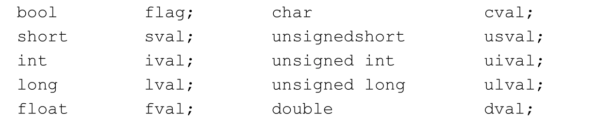
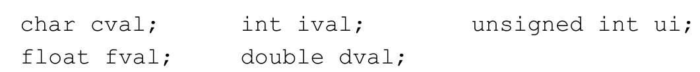

这里积累c++的相关知识。

mmap

# C++ Primer练习题
## 4.2
练习4.4 

## 4.11.1 
练习4.34
在下面的表达式中添加括号，说明其求值的过程及最终结果。编写程序编译该（不加括号的）表达式并输出其结果验证之前的推断。
12 / 3 * 4 + 5 * 15 + 24 % 4 / 2
((12 / 3) * 4) + (5 * 15) + 

根据本节给出的变量定义，说明在下面的表达式中将发生什么样的类型转换，需要注意每种运算符遵循的是左结合律还是右结合律。

a) if (fval)：float转换为bool类型

b) dval = fval + ival;：首先ival转换为float类型，加和之后转换为double类型。

c) dval + ival * cval;：首先cval转换为int类型，然后乘积的结果转化为double类型和dval进行相加。

练习4.35
假设有如下的定义，请回答在下面的表达式中发生了隐式类型转换吗？如果有，指出来。

a) cval = 'a' + 3; 发生了隐式类型转换，'a'从char转换为int，然后加和的结果从int转换为char。

b) fval = ui - ival * 1.0; 发生了隐式类型转换，ival从int类型转换为float类型，ui从unsigned int类型转换为float类型。

c) dval = ui * fval; 发生了隐式类型转换ui从unsigned int 转换为float类型。

d) cval = ival + fval + dval; ival转换为
